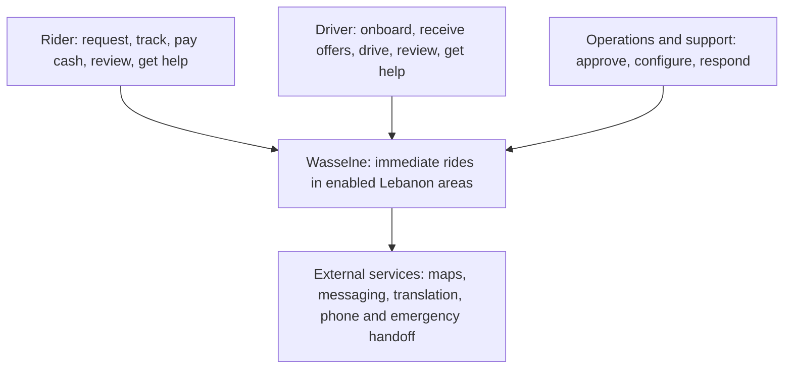
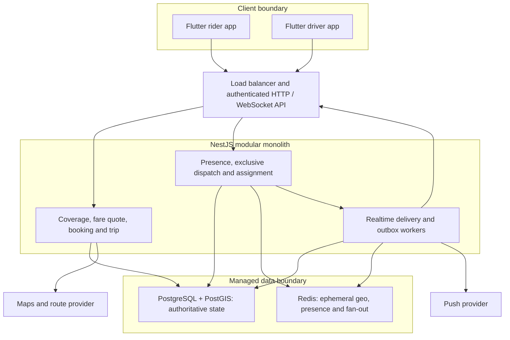
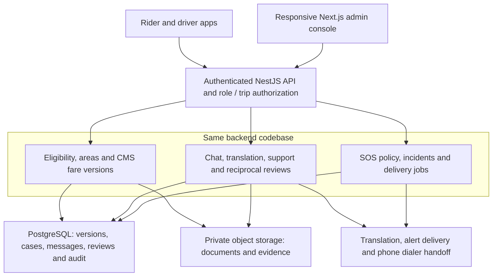
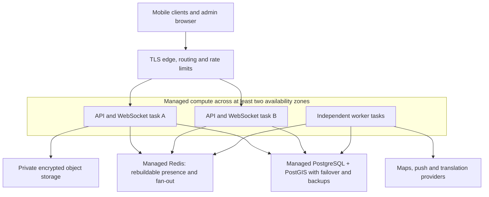
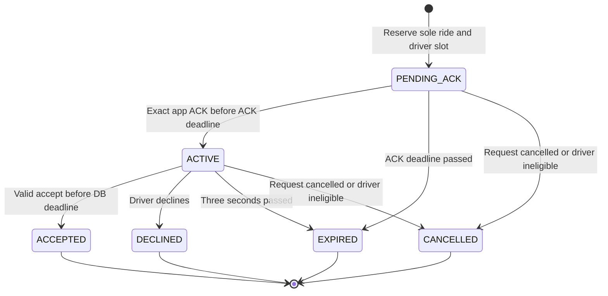
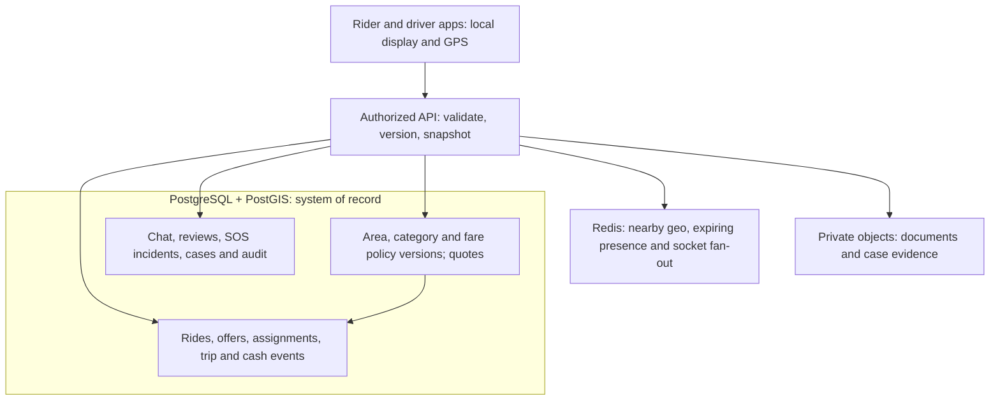
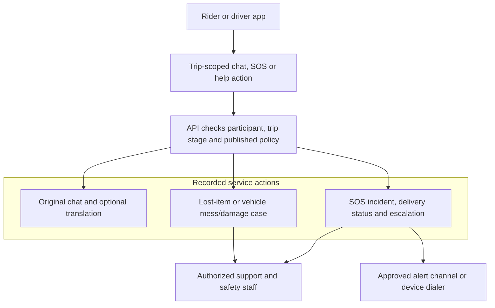

# Wasselne — Architecture diagrams

**Status:** Diagram stage, for owner review  
**Basis:** Approved Wasselne BRS, HLD, and LLD v0.1, including the subsequent clarification that fares are set in the CMS and the three-second offer window starts after authenticated driver-app receipt acknowledgment.  
**Reading order:** Business view (BRS) → logical and deployment views (HLD) → detailed behavior and records (LLD) → traceability.

These are **design diagrams**, not evidence that software or infrastructure exists. A line indicates an intended interaction, not permission to share unrestricted data. `TBD` policies remain open as identified in the approved documents. The reference applications are product comparisons and do not add requirements.

## BRS view — business scope

### D-01. People, service, and external responsibilities



**Scope within the platform:** selected car/taxi, motorcycle and tuk-tuk categories; Arabic, English and French selection; saved places; CMS fares; one-driver-at-a-time offers; trip tracking; cash; post-confirmation ordinary calls; translated chat; configurable SOS; two-way reviews; and lost-item / vehicle mess or damage support. Staged city activation is controlled by approved area polygons. Scheduled booking, bus service, and active OMT, Wish/Whish or bank payment are outside the enabled first-release flow. A public kiosk booking journey is **TBD**; adaptive screen layouts do not imply a live kiosk workflow.

**Trace:** BG-01–05; BR-01–49; NFR-06, NFR-10–11. D-01 identifies the business actors and boundaries; the diagrams below detail how specific requirements are fulfilled.

## HLD views — logical responsibilities and runtime

### D-02. Booking, location, and dispatch components



The backend checks live eligibility and database offer/assignment state after a Redis nearby-driver shortlist. Redis never decides whether an offer is valid or a ride is assigned. Maps provides routes and road ETA, not assignment authority. Workers recover from durable deadlines and outbox records. The driver app obtains the **same CMS fare snapshot** the rider saw; it has no price-entry flow.

**Trace:** HLD-01–02, HLD-04, HLD-07–14, HLD-19–20, HLD-22; LLD-01–02, LLD-04–07, LLD-09–10; BR-07–29, BR-45–46; NFR-01–03, NFR-07–08, NFR-12.

### D-03. Operations, communication, and safety components



Staff publish versioned area, category, fare/currency and SOS policies under role-based permissions with an audit record. A ride preserves the agreed fare/currency version. Driver documents and case evidence remain private. Chat keeps the original text beside any translation. SOS reports the observed action status and requires an actual staffing and response policy before an alert choice is enabled. Ordinary telephone calls use the device dialer after confirmation; no phone masking is promised. Lost-item and driver damage reports create reviewable support cases, never an automatic rider charge.

**Trace:** HLD-01–07, HLD-11, HLD-14–18, HLD-19, HLD-21–23; LLD-01–05, LLD-07–10; BR-01–08, BR-14–16, BR-24–25, BR-30–49; NFR-04–07, NFR-09–11.

### D-04. Deployment and failure boundaries



API/WebSocket processes and workers are deployment roles from **one modular monolith**. Production placement, cloud vendor, region, numerical availability targets, RPO/RTO and exact service sizing are **TBD**. DB failover can interrupt new acceptances; the system must not approve a ride from Redis during that interruption. Clients recover from server snapshots after reconnect. Development, staging, production, monitoring, backups, restoration exercises and controlled releases remain part of the platform plan.

**Trace:** HLD-04, HLD-08–10, HLD-14, HLD-19–24; LLD-04, LLD-06, LLD-09–10; BR-12–13, BR-17–22; NFR-01–05, NFR-07–08, NFR-12.

## LLD views — offers, records, and critical workflows

### D-05. Exclusive offer and three-second clock

```mermaid
sequenceDiagram
    participant R as Rider app
    participant A as NestJS API / dispatch
    participant P as PostgreSQL
    participant W as Outbox / expiry worker
    participant D as Intended driver app

    R->>A: Request ride with quote and idempotency key
    A->>P: Create or return ride; snapshot CMS fare
    A->>P: Lock ride; reserve one driver; create PENDING_ACK + outbox
    P-->>A: Offer ID and bounded ACK deadline
    W->>D: WebSocket / push alert for this offer
    D->>A: Authenticated ACK for exact offer ID
    A->>P: Lock offer; validate ACK deadline and eligibility
    P-->>A: ACTIVE; acceptance deadline = DB now + 3 seconds
    A-->>D: Same CMS fare + server acceptance deadline
    alt Valid acceptance before deadline
        D->>A: Accept exact offer with idempotency key
        A->>P: Atomic offer ACCEPTED + ride CONFIRMED + one assignment
        A-->>R: Confirmed trip snapshot
        A-->>D: Confirmed trip snapshot
    else No ACK, decline, or no valid accept
        W->>P: Lock ride; terminalize expired or declined attempt
        P-->>W: Old offer terminal; slot released
        W->>P: Create next PENDING_ACK only after old is terminal
        W-->>R: Searching or no-driver snapshot
    end
```

The worker-to-app arrow represents attempted delivery; it does **not** establish receipt or start the three seconds. An authenticated app ACK starts the three-second window from **database time**; repeated ACKs return the original deadline. Expired or late acceptances fail even if an old push arrives. Candidate lookup uses Redis GEOSEARCH before the first reservation transaction; the final eligibility, sole offer and sole assignment checks occur in PostgreSQL. Delivery-ACK timeout, reoffer cap, rider search limit and background-driver eligibility are **TBD**. When no other eligible driver remains, the same driver can receive a **new offer ID** under the eventual capped reoffer policy.

**Trace:** HLD-02, HLD-08–10, HLD-14, HLD-19–20, HLD-22; LLD-02, LLD-04, LLD-06–07, LLD-10; BR-09, BR-12–19, BR-22; NFR-01–03, NFR-07, NFR-12; VT-06–10, VT-17.

### D-06. Offer state and database invariant



The *same offer ID* cannot leave a terminal state. Partial unique database indexes admit only one `PENDING_ACK` or `ACTIVE` offer for each ride **and** each driver; separate partial unique indexes admit only one open assignment per ride **and** driver. Lock the parent ride during offer transitions, check driver eligibility and DB deadlines, and use idempotency keys for booking and acceptance. Driver acceptance itself moves the ride to `CONFIRMED`; no driver price proposal or second rider acceptance step exists. Push or WebSocket delivery does not override these database checks.

**Trace:** HLD-09–10, HLD-19, HLD-22; LLD-04, LLD-06–07, LLD-10; BR-12–13, BR-16–19, BR-22; NFR-02, NFR-12; VT-06–10.

### D-07. Authoritative record and live-data boundary



Each confirmed ride snapshots its quote's fare amount, currency and policy version. A saved place is owned by its rider and its coordinate is copied into the request; later edits never rewrite ride history. Redis GEO members must pass a separate freshness/accuracy/eligibility check; stale locations cannot produce offers. The driver and rider fetch an authoritative ride/offer snapshot on reconnect. Object bytes are accessed only through short-lived grants and ownership checks. No payment transaction is attempted for disabled OMT, Wish/Whish or bank methods. Cash collection is reported and reconcilable, not treated as externally verified settlement.

**Trace:** HLD-05–12, HLD-15–23; LLD-04–10; BR-05–29, BR-31–32, BR-34–49; NFR-02–05, NFR-07–09; VT-02–05, VT-10–16.

### D-08. Safety, support, and post-ride accountability



SOS choices are admin-published registered actions only. Opening an emergency dialer is not evidence that emergency services responded. Real alert options require a defined responder/channel and truthful delivery status. During the approved contact window after ride confirmation, a phone action opens the device dialer outside the app; caller IDs may be visible. After completion, rider and driver can each submit one trip-linked review of the other. A damage report opens a human-reviewed case with private evidence and no automatic rider charge. Response staffing, number exposure duration, review format and case remedies remain **TBD**.

**Trace:** HLD-14–18, HLD-19, HLD-21–23; LLD-02–04, LLD-08–10; BR-30–40, BR-42–43, BR-47–49; NFR-04–05, NFR-07, NFR-09; VT-13–16.

## Requirements traceability matrix

Each row covers the inclusive source-ID range shown; the diagram IDs identify where the behavior or architecture is represented, and the HLD/LLD IDs identify the approved design specification. D-01 provides business context for all functional requirements, while the additional diagram IDs below show the detailed relationships. `VT` are **planned** LLD verification scenarios, not test results.

| Source requirements | Diagram IDs | Approved design IDs | Planned evidence |
| --- | --- | --- | --- |
| BR-01–04; NFR-06 | D-01, D-03, D-04 | HLD-01–05, HLD-23; LLD-01–04 | VT-01, VT-13 |
| BR-05–08 | D-01–03, D-07 | HLD-02–03, HLD-05–06, HLD-08, HLD-19–21; LLD-02–06, LLD-09 | VT-02, VT-05 |
| BR-09–11 | D-01–02, D-05, D-07 | HLD-01, HLD-07–10, HLD-13, HLD-19–20; LLD-01, LLD-05–07, LLD-09 | VT-03–05, VT-11 |
| BR-12–13; NFR-12 | D-02, D-04–07 | HLD-02, HLD-09, HLD-14, HLD-19, HLD-22–23; LLD-02, LLD-04, LLD-06, LLD-10 | VT-06–09, VT-17 |
| BR-14–16; BR-24–26 | D-01–03, D-05, D-07 | HLD-01–03, HLD-09–11, HLD-19; LLD-01–03, LLD-06–07 | VT-06, VT-11 |
| BR-17–18 | D-02, D-04–07 | HLD-04, HLD-09–10, HLD-19, HLD-22; LLD-04, LLD-06–07, LLD-10 | VT-08, VT-10 |
| BR-19–23; NFR-02–03 | D-01–02, D-04–07 | HLD-01–02, HLD-08–10, HLD-13–14, HLD-19–20; LLD-01–02, LLD-04, LLD-06–07, LLD-09 | VT-05, VT-10, VT-17 |
| BR-27–29 | D-01, D-02, D-07 | HLD-11–12, HLD-19; LLD-07, LLD-09 | VT-12 |
| BR-30–32 | D-01, D-03, D-08 | HLD-01–02, HLD-14–15, HLD-19; LLD-01–02, LLD-04, LLD-08–09 | VT-13 |
| BR-33–37 | D-01, D-03, D-07–08 | HLD-01–03, HLD-14, HLD-16–17, HLD-19, HLD-22; LLD-01–03, LLD-08–10 | VT-14, VT-16 |
| BR-38–40 | D-01, D-03, D-07–08 | HLD-01–03, HLD-18–19; LLD-01–03, LLD-08 | VT-15 |
| BR-41–44 | D-01, D-03, D-07–08 | HLD-03, HLD-06–07, HLD-11, HLD-17, HLD-19, HLD-23; LLD-03, LLD-05, LLD-07–08, LLD-10 | VT-02–03, VT-11, VT-14 |
| BR-45 | D-01–03, D-07 | HLD-03, HLD-07, HLD-19; LLD-03, LLD-05 | VT-03 |
| BR-46 | D-01–02, D-07 | HLD-01, HLD-07, HLD-13, HLD-19; LLD-01, LLD-05, LLD-09 | VT-04 |
| BR-47–49 | D-01, D-03, D-07–08 | HLD-01–03, HLD-16, HLD-19, HLD-21–22; LLD-01–03, LLD-08–10 | VT-16 |
| NFR-01 | D-02, D-04–06 | HLD-04, HLD-08–09, HLD-13–14, HLD-20, HLD-23–24; LLD-04, LLD-06, LLD-09–10 | VT-08, VT-17 |
| NFR-04–05 | D-03–04, D-07–08 | HLD-01–06, HLD-15–19, HLD-21, HLD-23–24; LLD-01–05, LLD-08–10 | VT-02, VT-13–16 |
| NFR-07–08 | D-02, D-04–07 | HLD-09–12, HLD-14, HLD-17, HLD-19, HLD-22–24; LLD-06–08, LLD-10 | VT-07–08, VT-14, VT-17 |
| NFR-09–10 | D-01, D-03–04, D-07–08 | HLD-03, HLD-05–07, HLD-11, HLD-17, HLD-23–24; LLD-03–05, LLD-07–10 | VT-02–03, VT-11, VT-14 |
| NFR-11 | D-01, D-03–04 | HLD-01–03, HLD-23; LLD-01–03 | VT-01 |

**Open decisions inherited from the approved documents:** exact initial area polygons/order and eligible documents; fare formula/rates, quote validity, USD↔LBP/cash treatment and commission; ACK timeout, background-driver eligibility and bounded reoffers; sign-in, phone visibility, retention and targets; SOS staffing/channels, review/case policy and kiosk operating model. The only agreed offer acceptance window is **three seconds after app ACK**. See BRS OD-01–16 and LLD §14 for the decision owners and implementation dependencies.

**Review boundary:** Approval of these diagrams establishes a visual reference to the approved BRS/HLD/LLD. It does not resolve TBD business policy or authorize implementation, payment activation or production launch.
