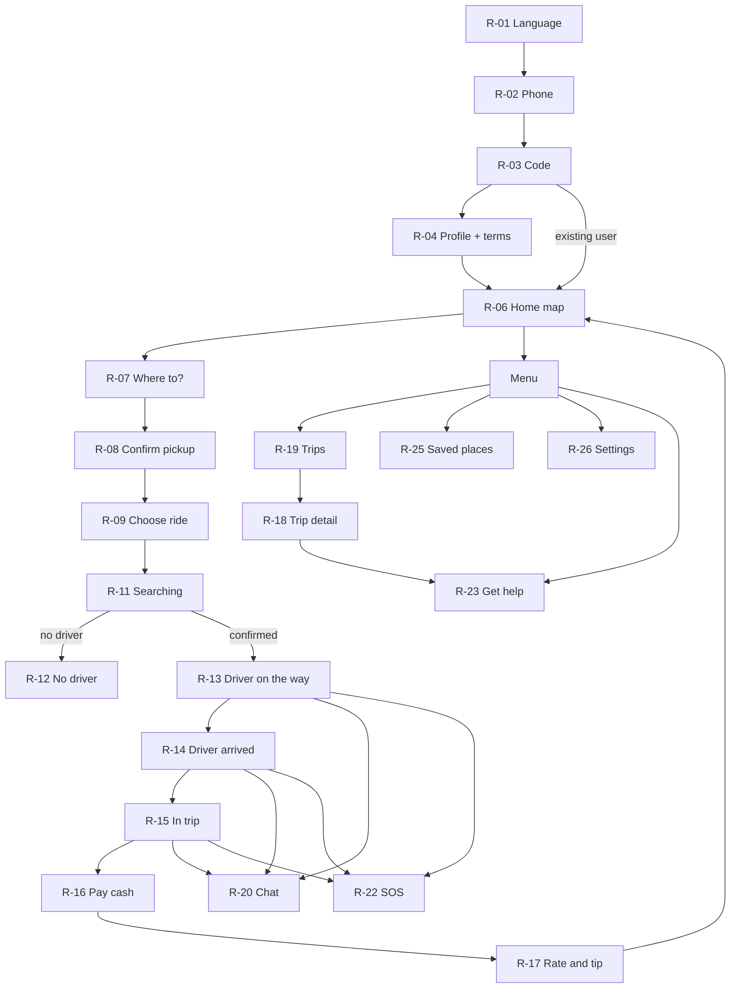
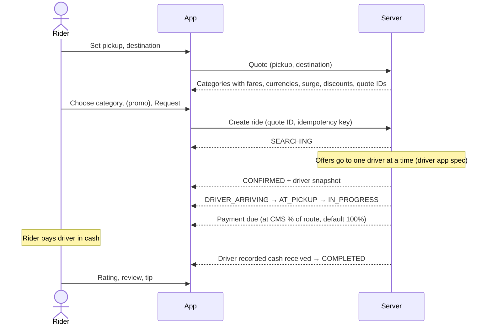

# Wasselne — Phase 1.1: Rider App (Wasselne)

**Status:** Draft for owner review (Phase 1). Design only; no application code.
**Follows:** `00_Design_Direction_and_Patterns.md` (global states, permissions, money display, RTL) and the Phase 0 Register decisions (D-xx).
Wireframes are shown in English, left-to-right. In Arabic every layout mirrors (see 00 §3). Screen IDs are R-xx.

---

## 1. Navigation map



Menu entry: avatar button at the top start corner of Home. There is no bottom tab bar, which keeps the map large.

## 2. Core flows

### 2.1 Booking to payment



Every state arrives by socket event or is read from the server on resume. If the app was killed, opening it goes straight to the active ride screen (BR-22).

### 2.2 Recovery rules

| Situation | Behaviour |
|---|---|
| Tap "Request" twice or the network drops | Same idempotency key; the server returns the same ride. The UI never shows two searches. |
| Request times out | "Checking your request…" then read active ride. Only if none exists does the app offer "Try again". |
| App reopened during a ride | Loads active ride snapshot, jumps to the matching screen. |
| Socket drops | Offline banner; poll the snapshot every 10 s (value set in Phase 2) until reconnected. |
| Driver location stale | Car icon turns grey with "Updated 1 min ago". ETA is hidden rather than guessed. |

---

## 3. Screen specifications

### R-01 Language

First launch only; later in Settings. Three large buttons, each written in its own language: "العربية", "English", "Français". Preselects the phone language if it is one of the three. Choice applies immediately, including RTL.

### R-02 Phone number (sign-in and sign-up)

- Country code fixed to +961 with a picker for others (`TBD-R-01`: allow foreign numbers?).
- Number field with Lebanese format hint. "Continue" sends the SMS code (D-18).
- Links to the current Terms and Privacy Policy (from CMS, D-22).
- Errors: invalid number; too many attempts ("Try again in 10 min", value from server).

### R-03 SMS code

- 6-digit field with autofill from SMS where the OS allows.
- "Resend code" enabled after a server-provided countdown.
- Wrong code: "That code isn't right. X tries left." Expired: "This code expired. Send a new one."

### R-04 Create profile

Shown only for new riders.

| Field | Rule |
|---|---|
| First name, last name | Required. Any script. |
| Gender | Required: Female / Male. Helper text: "Used only for women-only ride options. Wasselne may confirm this after your first ride." (D-39) |
| Email | Optional, for receipts. |
| Terms | Checkbox: "I accept the Terms of Service and Privacy Policy" with links. Stores the version ID accepted (D-22). |

Button "Create account". The screen never pre-ticks the terms box.

### R-05 Updated terms

Full-screen when the server says a new version requires acceptance. Shows a short "What changed" summary from the CMS plus the full text link. "Accept and continue". Declining leads to "You need to accept the updated terms to request rides" with a sign-out option. Past rides and help stay viewable.

### R-06 Home map

```
┌──────────────────────────────────┐
│ (●) avatar                  [◎]  │  ◎ = recenter
│                                  │
│          MAP                     │
│      🚕     🛺        🚕         │  coarse nearby vehicles
│              ◉ you               │
│                                  │
├──────────────────────────────────┤
│  ▔▔▔                             │
│  Where to?                    🔍 │
│  ⌂ Home     💼 Work    + Add     │  saved places chips
│  ↺ Hamra St, Beirut              │  recent
│  ↺ Ehden main square             │
└──────────────────────────────────┘
```

- Nearby vehicles are coarse (positions snapped and delayed; BR-11 and LLD §5 privacy). Their icons come from each category's CMS icon.
- **Outside coverage:** the sheet says "Wasselne isn't available here yet" and lists active areas by name (from CMS). "Where to?" stays usable so a rider can check another pickup.
- **No location permission:** map centres on the last active zone; "Where to?" still works; a small "Use my location" link opens the permission rationale.
- **Active ride exists:** Home is skipped; the app opens the ride screen.

### R-07 Where to? (pickup and destination)

- Two stacked fields: pickup (defaults to "Current location") and destination (focused).
- Results order: saved places matching the text → recent → provider search results.
- "Choose on map" option sets a pin.
- Saved place chips fill a field in one tap. The trip stores a copy of the coordinates (D-07 area; editing the saved place later does not change past rides).
- Errors: provider unavailable → "Search isn't working right now. Choose on the map instead."

### R-08 Confirm pickup

Map with a fixed centre pin; rider drags the map. Label shows the resolved address and "Is this where you'll be?". Warnings:
- Pin outside coverage → button disabled, "Pickup is outside our service area."
- GPS accuracy poor → "Your location may be off by about 200 m. Move the pin to the exact spot."

### R-09 Choose ride

```
┌──────────────────────────────────┐
│ ←  Hamra St → AUB Main Gate      │
│         MAP with route           │
├──────────────────────────────────┤
│ ● 🚕 Car           4 min away    │
│   USD 4.50 · LBP 400,000         │
│ ○ 🏍 Motorcycle    2 min away    │
│   USD 2.75 · LBP 245,000         │
│ ○ 🛺 Tuk-tuk   20% off           │
│   ~~USD 3.00~~ USD 2.40 · LBP …  │
│ ○ 🚕 Women's taxi  ×1.5 busy     │
│   USD 6.75 · LBP 600,000         │
│ ─────────────────────────────── │
│ 💵 Cash          🏷 Promo code   │
│ [        Request Car          ]  │
└──────────────────────────────────┘
```

- **Categories** come from the server in CMS order. Only categories enabled in this zone and with at least one nearby available driver are selectable. Others show "No drivers nearby" greyed out. New CMS categories appear automatically (D-24).
- **Women's taxi** (D-35) appears only for riders who declared Female. Info icon: "Women drivers for women riders."
- **Fare line** follows 00 §4: both currencies when both are published (D-19), discount strike-through with reason (D-23), surge badge (D-25), and in recalculation mode the note "Estimated. Final fare can be up to 20% higher." (D-20; percentage from CMS).
- **"4 min away"** is the road ETA for the nearest candidate, labelled as an estimate. If no ETA is available, show nothing rather than a guess.
- **Tap a fare line** to open a breakdown sheet: base, distance, time, surge, add-ons, discount, total per currency.
- **Payment row** shows Cash. Only CMS-enabled methods appear (D-38). Disabled methods are hidden.
- **Promo code** opens R-10.
- **Quote expiry:** if the quote expires while on this screen, the fares refresh with the message "Prices updated". If a price changed, the rider must tap Request again.
- **Request** is disabled while the quote is loading or stale.

### R-10 Promo code

Bottom sheet with a single field and "Apply". Server validates. Result messages: "Code applied: 15% off, up to USD 2.00", "This code has expired", "This code isn't valid for Motorcycle", "You've already used this code". Applied code shows as a chip with remove (×) on R-09.

### R-11 Searching

```
┌──────────────────────────────────┐
│           MAP (pickup pin)       │
├──────────────────────────────────┤
│  Finding your driver…            │
│  ░░░░░░░░░▓▓▓▓░░░░░ (indeterm.)  │
│  Car · USD 4.50 · Cash           │
│  Pickup: Hamra St                │
│                                  │
│  [       Cancel request       ]  │
└──────────────────────────────────┘
```

- Indeterminate progress. Never "Contacting 5 drivers" or a countdown, since the server moves through drivers one at a time and the rider doesn't need that detail.
- Cancel: confirmation sheet (R-28).
- Leaving the app is fine; a notification arrives on confirmation.

### R-12 No driver found

Shown when the server ends the search (MAX_RIDER_SEARCH_DURATION, `TBD` in Phase 2). Copy: "No drivers are available right now." Actions: "Try again" (new quote), "Try another ride type". No fee.

### R-13 Driver on the way

```
┌──────────────────────────────────┐
│ [SOS]                            │
│          MAP  🚕 ─ ─ ─ ◉         │
├──────────────────────────────────┤
│  Arriving in about 4 min         │
│  ┌────┐ Rami K.   ★ 4.8          │
│  │ 📷 │ Toyota Corolla · White   │
│  └────┘ Plate  B 123456          │
│  [📞 Call]  [💬 Chat]  [⋯ More]  │
│  Car · USD 4.50 · Cash           │
└──────────────────────────────────┘
```

- **Driver card:** photo, first name and last initial, rating, vehicle make, model and colour, plate in large type for matching.
- **Map:** driver icon with a heading arrow. If the location is stale, the icon turns grey with "Updated 1 min ago" and the ETA is hidden.
- **Call:** opens the phone dialer with the driver's number (D-44). The app says nothing about whether the call connected.
- **More menu:** Cancel ride, Share trip status (`TBD-R-02`, proposed later version), Get help.
- **SOS** stays in the top start corner on every active-ride screen.

### R-14 Driver has arrived

Top banner and notification: "Your driver has arrived." Shows plate large. If the CMS sets a no-show wait (Q13, Phase 2), the timer text comes from the server: "Your driver will wait until 14:32." Actions as R-13.

### R-15 In trip

```
┌──────────────────────────────────┐
│ [SOS]                            │
│      MAP with route and car      │
├──────────────────────────────────┤
│  On the way to AUB Main Gate     │
│  Arriving about 14:48            │
│  Rami K. · B 123456              │
│  [📞 Call] [💬 Chat] [⋯ More]    │
│  USD 4.50 · Cash                 │
└──────────────────────────────────┘
```

- In recalculation mode the fare line reads "Estimated USD 4.50 (up to USD 5.40)".
- **Payment prompt:** when the trip passes the CMS payment percentage (D-28; default 100% = trip end), a sheet slides up (R-16).

### R-16 Pay your driver

```
┌──────────────────────────────────┐
│  Pay your driver in cash         │
│                                  │
│      USD 4.50                    │
│   or LBP 400,000                 │
│                                  │
│  Base, distance, time    ▸ details│
│  Discount (Tuk-tuk 20%)  −0.60   │
│                                  │
│  Waiting for driver to confirm…  │
│  [ I have a problem with this ]  │
└──────────────────────────────────┘
```

- Amount is the agreed fare, or the recalculated final fare within the cap. When final ≠ quote, both are shown: "Quoted USD 4.50 · Final USD 4.95 (longer route)".
- The status stays "Waiting for driver to confirm…" until the driver records cash. Then: "Driver recorded USD 4.50 received." The rider app never marks payment itself.
- **"I have a problem with this"** opens a fare-dispute case (R-23) linked to the ride.
- **Future non-cash methods (D-29):** the same screen would show the method's status, and on failure: "Payment didn't go through. Please pay your driver in cash." Not active at launch.

### R-17 Rate your trip

- Stars 1–5 (format `TBD` Q15, Phase 2), optional comment, optional quick tags (CMS list).
- **Tip (D-37):** chips "USD 1 · USD 2 · USD 3 · Other" (amounts `TBD`, from CMS). Copy: "Tips go fully to your driver. Hand it over in cash." The tip is recorded for information only (D-42).
- **Proposed rule, for owner review:** the tip section appears only on the end-of-trip screen, while the rider is still with the driver. When rating later from trip history, only the rating shows, because a cash tip can't reach a driver who has left.
- "Skip" is always available. One review per ride (BR-39).

### R-18 Trip detail and receipt

Route map snapshot, date, pickup and destination, driver, vehicle, category, fare breakdown in the paid currency, "Cash, recorded by driver", status history, rating given. Actions: "Get help with this trip", "Lost an item?", "Email receipt" (if email set).

### R-19 Trips

List of rides, newest first, grouped by month. Row: date, destination, category icon, amount + currency, status chip (Completed, Cancelled, No driver). Empty state: "Your trips will appear here."

### R-20 Chat

```
┌──────────────────────────────────┐
│ ← Rami K. · B 123456             │
├──────────────────────────────────┤
│ ┌──────────────────────────┐     │
│ │ I'm at the pharmacy door │     │
│ │ Translated from Arabic   │     │
│ │ · Show original          │     │
│ └──────────────────────────┘     │
│        ┌────────────────────────┐│
│        │ Coming now, 1 min      ││
│        │ Sent ✓   Seen ✓✓       ││
│        └────────────────────────┘│
│ [ Quick replies: I'm here ▸ ]    │
│ [ Type a message…         ] [➤]  │
└──────────────────────────────────┘
```

- Incoming messages show the translation into the rider's language, with "Translated from X · Show original". Tapping shows the original (BR-32).
- If translation fails: the original is shown with "Translation unavailable · Retry".
- Outgoing states: Sending → Sent (server stored) → Seen (recipient opened). Failed: "Not sent · Retry". Message retry uses the same client ID, so there are no duplicates.
- Chat is open from confirmation until the contact window closes (D-44 governs calls; chat window uses the same CMS value unless Phase 2 separates them).
- Top of chat shows a one-line notice: "Messages may be reviewed by Wasselne for safety and support." (C-10, D-33)

### R-21 Calling

No custom screen. Call button opens the system dialer with the other party's number. It appears only inside the window from confirmation until the CMS time after the trip (D-44). After the window: button hidden, and the trip detail reads "Calling is available until 30 min after a trip." The value comes from the CMS.

### R-22 SOS

```
┌──────────────────────────────────┐
│  Safety                        ✕ │
│                                  │
│  [ 💬 Chat with a Wasselne       │
│       safety agent now        ]  │
│  An agent will read your message │
│  and call you on +961 3 xxx xxx. │
│                                  │
│  Share: your trip, driver, and   │
│  live location with the agent.   │
└──────────────────────────────────┘
```

- **Button:** red SOS button (56 dp) on every active-ride screen, from confirmation to 30 min after completion (`TBD-R-03`, proposed default).
- **Action list** comes from the published SOS configuration (D-17). At launch it holds one action: priority agent chat.
- **Opening** the chat immediately sends a priority incident with trip, driver, and location to the server.
- **Truthful statuses** shown at the top of the SOS chat:
  - "Sending…" means the request has not reached the server yet.
  - "Request received by Wasselne" means the server stored the incident.
  - "Agent Maya joined" means an agent took ownership.
  - "Agent says they are calling you" appears only when the agent records it.
  - "Resolved" appears when the agent closes the incident.
- **No agent online (D-21):** the server returns this in its response. The screen then shows the CMS emergency number as a large button, "Call [number]", with the copy "No agent is available right now. On-call staff have been alerted." That line appears only if the alert job was queued, and otherwise reads "We couldn't alert staff."
- **No network:** "You're offline. Call [CMS emergency number] now." The number is cached from the last published SOS config.
- The app never says "Help is on the way."

### R-23 Get help

Topics: "I lost an item", "Problem with the fare or payment", "Driver behaviour", "Safety concern", "Something else". Each creates a case linked to the trip if one is selected.

**Lost item flow:** item description, optional photo, best contact time → "Case opened. Support will contact your driver and update you here." (BR-47). The rider never gets automatic access to the driver's number outside the D-44 window.

### R-24 Case detail

Status timeline (Opened, In review, Waiting for you, Resolved with reason), messages with support, evidence thumbnails (private). Actions: reply, add photo.

### R-25 Saved places

List with name, address, icon. Add, edit, delete (confirmation). Name is free text ("Mama's home"). Picker uses R-07 search or the map. Empty state as in 00 §7. Limit `TBD-R-04` (proposed 20).

### R-26 Settings

Language · Preferred display currency (when both published) · Notifications · Terms, Privacy, and policies (current published versions per language) · Delete account (store requirement; retention of trip records per Q17) · Sign out · App version.

### R-27 Account paused

Global full-screen state from 00 §7. If a block is issued during a trip, it applies only after the trip ends (D-41). The rider completes the current ride normally.

### R-28 Cancel ride

Sheet with reasons (CMS list). The server sends whether a fee applies (policy Q13, Phase 2). The sheet shows "No cancellation fee" or "A fee of USD 1.00 applies" only as the server states. "Keep my ride" is the default, emphasized button.

---

## 4. Tablet layout

Map fills the screen; a 400 dp side panel on the start side holds whatever the phone's bottom sheet holds. SOS stays top start on the map.

## 5. Open items

| ID | Item | Proposed default |
|---|---|---|
| TBD-R-01 | Allow non-Lebanese phone numbers | Yes, any country code |
| TBD-R-02 | Share live trip with a friend | Later version |
| TBD-R-03 | SOS button visibility window | Confirmation to 30 min after completion |
| TBD-R-04 | Maximum saved places | 20 |
| TBD-R-05 | Tip only on the end-of-trip screen (R-17 proposed rule) | Yes |
| TBD-R-06 | Tip preset amounts | CMS values |
