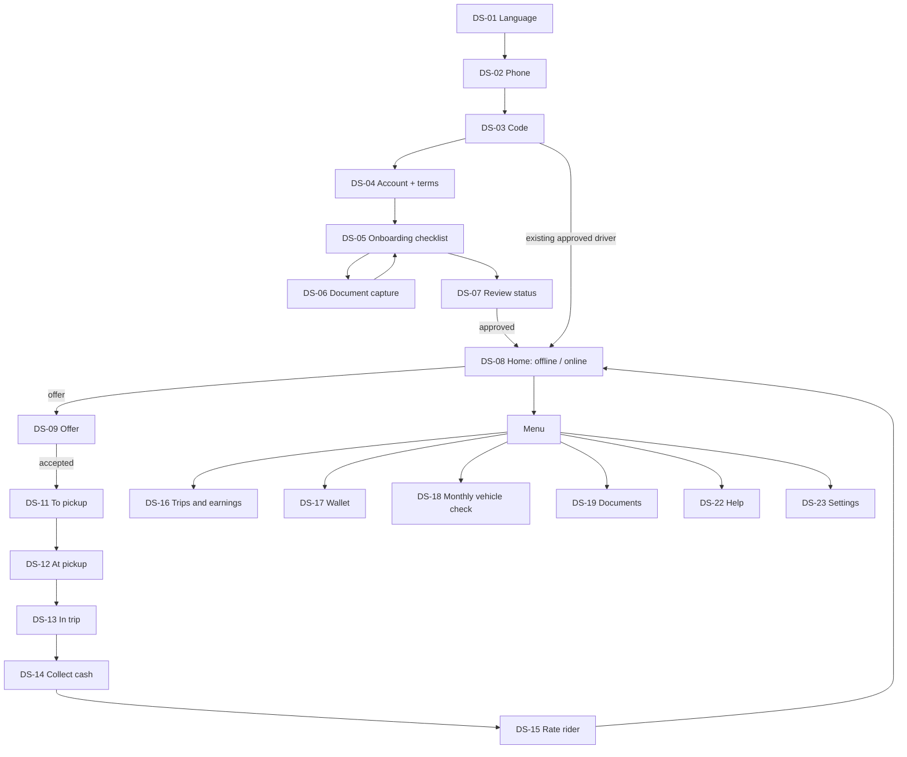
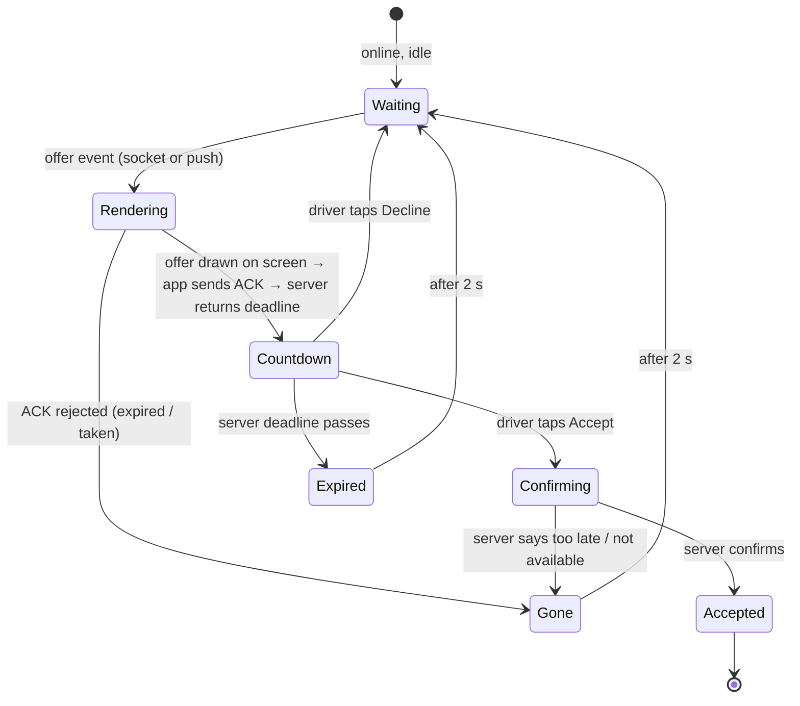

# Wasselne — Phase 1.2: Driver App (Wasselne Driver)

**Status:** Draft for owner review (Phase 1). Design only; no application code.
**Follows:** `00_Design_Direction_and_Patterns.md` and the Phase 0 Register decisions (D-xx). Screen IDs are **DS-xx**, so they don't clash with decision IDs (D-xx).
Driver screens are designed to be read in one glance at arm's length in a moving car. Dark theme is the default while online at night.

---

## 1. Navigation map



## 2. Offer handling (the exclusive three-second window)

This is the most important interaction in the product. The rules come from BR-12/13, D-04, and the LLD offer state machine.

### 2.1 What the driver experiences



### 2.2 Design decisions for Phase 2 to confirm

1. **ACK is sent only once the offer is visibly on screen.** The app is in the foreground, the screen is on, and the offer card is rendered. A push that wakes a backgrounded app does not ACK by itself. It raises a full-screen alert, where the OS allows it, and the ACK is sent when the offer is drawn. This makes "app receipt" as close as possible to "driver can see it". The architecture already says an ACK is not proof a human saw the offer (BRS, HLD §4.2), and this rule narrows that gap. If the ACK timeout passes first, the offer moves on without penalty.
2. **Countdown source.** The countdown uses the server's `accept_deadline_at` minus the server's `server_now` from the ACK response. It then runs on the phone's monotonic clock and never on the phone's wall clock. The ring may reach zero slightly before the server does. Taps near zero still go to the server, which decides.
3. **Sound and vibration start when the card is drawn**, not when the push arrives.
4. **Keep-awake while online** (proposed, Settings toggle, default on). The screen stays on while the driver is online on the Home screen, so offers land in the foreground. This is the most reliable way to meet three seconds on real phones.
5. **No penalty display.** Missed or declined offers show no warnings or scores. An acceptance-rate policy does not exist and is not invented (`TBD-DS-01`).

### DS-09 Offer screen

```
┌──────────────────────────────────┐
│  NEW RIDE              ◔ 3       │  countdown ring + seconds
│                                  │
│  USD 4.50                        │  fare, 40 sp
│  LBP 400,000                     │
│  🚕 Car   ×1.5 busy              │
│                                  │
│  Pickup  4 min · 1.2 km          │  24 sp
│  Hamra, near Bliss St            │
│  Trip    ~6.8 km · ~18 min       │
│  To      Achrafieh               │  area only
│  Rider ★ 4.9                     │
│                                  │
│ ┌──────────────────────────────┐ │
│ │                              │ │
│ │           ACCEPT             │ │  96 dp tall, full width
│ │                              │ │
│ └──────────────────────────────┘ │
│  [          Decline           ]  │  64 dp, separated by 16 dp
└──────────────────────────────────┘
```

- **Fare** in every published currency (D-19). The fare is read-only, and the screen has no price input (D-03). In recalculation mode it adds "Estimated; can change up to +20%". The percentage comes from the CMS.
- **Destination** shows the area name and trip length, not the exact address (`TBD-DS-02`: owner confirms drivers see the destination area before accepting). The full address appears after acceptance.
- **Accept** is a single tap: a swipe takes too long for three seconds. A mis-tap is guarded by the button size and by separating the two buttons.
- **Accessibility:** the screen reader announces "New ride offer, USD 4.50, pickup 4 minutes, 3 seconds". Text scaling is capped at 130% on this screen only (00 §6).
- **Tablet landscape:** the offer takes the full screen too, with the card on one side and the buttons on the other.

### DS-10 Offer outcomes

| Outcome | Copy | Duration |
|---|---|---|
| Confirming (after Accept) | "Confirming…" with spinner; buttons disabled | Until server replies. On timeout, the app reads the current offer and ride state before showing anything |
| Accepted | "Ride confirmed" → goes to DS-11 | Immediate |
| Too late / taken | "This ride is no longer available." | 2 s, then back to Waiting |
| Expired (no tap) | "Offer expired." | 2 s |
| Declined | Returns to Waiting silently | — |

The copy never says "sent to another driver", because the app doesn't know that.

---

## 3. Screen specifications

### DS-01 to DS-03 Language, phone, code

Same as rider R-01 to R-03 (D-18).

### DS-04 Create driver account

First name, last name as on ID. Gender (Female / Male), required. It is used for women-only category eligibility, verified against ID by admin (D-32, D-35). Email optional. Terms and driver agreement acceptance with version stored (D-22). The driver agreement is its own CMS legal document type.

### DS-05 Onboarding checklist

```
┌──────────────────────────────────┐
│  Become a Wasselne driver        │
│  3 of 6 done                     │
│  ✓ Personal details              │
│  ✓ Profile photo                 │
│  ✓ Ride types  (Car)             │
│  ▢ Vehicle details           ▸   │
│  ▢ Documents  (2 of 5)       ▸   │
│  ▢ Vehicle photos            ▸   │
│  [   Submit for review (off)  ]  │
└──────────────────────────────────┘
```

- **Ride types:** the list of CMS categories with their requirements, such as vehicle type, seats, women-only, and required documents (D-24). Choosing a category adds its required documents to the list. The women's category appears only to drivers who declared Female.
- **Vehicle details:** base type (car, motorcycle, tuk-tuk), make, model, year, colour, plate, seats. Fields shown depend on the base type.
- **Documents:** the list comes from the CMS per category (document list `TBD` Q14; nothing invented). Each document tile has states: Missing, Uploading %, Uploaded, Needs changes (with admin reason), Approved, Expiring soon, Expired.
- **Progress is saved on the server** after each step, so the driver can stop and continue on another day.
- Submit is enabled only when every required item is uploaded.

### DS-06 Document and photo capture

- Camera overlay with a frame for ID cards and documents; tips: "Place on a flat surface, avoid glare."
- On-device quality checks (blur, darkness, frame) warn but don't block: "This photo looks blurry. Retake?"
- Gallery upload allowed for documents, not for the profile selfie or vehicle checks (`TBD-DS-03`).
- Expiry date field when the CMS marks the document as expiring.
- **Upload:** the image is compressed, then uploaded directly to private storage through a short-lived upload grant (D-32, HLD-21). Upload is resumable on weak networks. States: "Uploading 40%", "Waiting for network", "Uploaded". Failed uploads retry from the queue; the driver can leave the screen.

### DS-07 Review status

| State | Screen |
|---|---|
| Submitted | "Thanks. We're reviewing your documents. We'll notify you." Shows submitted date. No promised review time. |
| Needs changes | List of items with admin reasons; each opens DS-06 to replace. |
| Approved | "You're approved for Car. You can go online." Button to Home. |
| Rejected | Reason from admin and support contact. |

### DS-08 Home (offline / online)

```
OFFLINE                              ONLINE
┌──────────────────────────────┐    ┌──────────────────────────────┐
│ ≡            Wallet USD 12.40│    │ ≡  ● Online · Car  [SOS]     │
│         MAP (you)            │    │         MAP (you)            │
│                              │    │   Beirut zone                │
├──────────────────────────────┤    ├──────────────────────────────┤
│  You're offline              │    │  Waiting for ride offers…    │
│  [      Go online       ]    │    │  Today: 5 trips · USD 22.50  │
│  Ride types: Car ✓ Moto ✓    │    │  cash collected              │
└──────────────────────────────┘    │  [      Go offline      ]    │
                                    └──────────────────────────────┘
```

**Go online checks.** Each failed check shows a specific blocking card with the fix:

| Check | Message and fix |
|---|---|
| Account approved for at least one ride type | "Your documents are under review." |
| Not blocked (D-34) | "Your account is paused. Contact support." |
| Documents valid | "Your licence expired on 12 Sep. Upload a new one." |
| Monthly vehicle check not overdue beyond grace (D-40) | "Vehicle check overdue. Submit photos to go online." |
| Location "all the time" / foreground service allowed | Rationale and Settings button |
| Notifications allowed | Rationale and Settings button |
| Battery optimisation off (Android, where the OEM kills apps) | Guided steps per phone brand (`TBD-DS-04` list) |
| In an active zone | "You're outside the service area." |
| Fresh GPS fix | "Waiting for GPS…" |
| Debt limit, only if enabled in the CMS (D-43) | "Settle your balance to go online." |

- **Ride types toggle:** a driver approved for several categories can pause any of them.
- **Online:** persistent system notification "Wasselne Driver: you're online". The GPS heartbeat runs. If the GPS goes stale or permission is lost, the server stops sending offers and the app shows "You're not receiving offers: weak GPS signal." The driver is not silently kept "online".
- **Reminders:** a monthly vehicle check reminder appears as a banner from 7 days before due (G-3 default).

### DS-11 To pickup

Map with route to pickup, pickup address in full, rider first name, rider rating, category. Buttons: **Navigate** (opens Google Maps or Waze with the pickup; navigation handoff per Q19 default, embedded navigation decided in Phase 2), Call, Chat, "I've arrived". "I've arrived" asks for confirmation if the driver is more than 150 m from the pickup (`TBD-DS-05`). The more menu has "Cancel ride" with reasons (policy Q13).

### DS-12 At pickup

- Server-provided wait timer: "Waiting since 14:28".
- **Start trip:** asks "Is Rana with you?" before starting.
- **Rider not here (no-show):** enabled after the CMS wait time (Q13); records a no-show.
- **Women's category mismatch (D-39):** "Rider doesn't match this ride type" ends the ride without penalty to the driver and opens a report for management.

### DS-13 In trip

Route to destination with full address. Navigate, Call, Chat, SOS. **End trip** uses a swipe control, because this action is not time-critical and mistakes are costly. If the CMS payment percentage is below 100% (D-28), a banner appears when the trip passes that point: "Collect payment now: USD 4.50".

### DS-14 Collect cash

```
┌──────────────────────────────────┐
│  Collect cash                    │
│  USD 4.50   or   LBP 400,000     │
│                                  │
│  [ Received USD 4.50          ]  │
│  [ Received LBP 400,000       ]  │
│  [ Different amount / problem ]  │
│                                  │
│  Tip received (optional)         │
│  [ USD ___ ]                     │
└──────────────────────────────────┘
```

- One tap records the exact amount and currency (D-19, BR-27). "Different amount / problem" asks for the amount received and a reason, and flags the ride for review. The app never edits the fare.
- **Tip:** optional field, information only, with no commission (D-37, D-42).
- **Recalculated fare:** when the final fare differs from the quote, both are shown with the reason, as on the rider screen.
- The recorded amount appears on the rider's screen (R-16). Recording is idempotent: a double tap records once.
- **Future non-cash methods:** this screen appears only if the rider's in-app payment failed (D-29). Not active at launch.

### DS-15 Rate rider

Stars, optional tags and comment, "Skip". One per ride.

### DS-16 Trips and earnings

List per day and week: trips, fares, cash collected per currency, tips recorded. Trip detail: route, times, fare breakdown, commission line when the ride's commission flag is on (D-42). Help entry per trip. Earnings are shown in each currency separately; they are never converted.

### DS-17 Wallet

- **Balance** with a clear direction: "Wasselne owes you USD 18.00" or "You owe Wasselne USD 6.20". Shown per currency.
- **Entries:** trip commission, discount compensation (D-31), adjustments with reason, payouts, settlements. Read-only, never edited (D-30).
- **Next payout:** "When your balance reaches USD X or on 14 Oct, whichever comes first". X and Y come from the CMS.
- **How to settle:** lists only CMS-enabled settlement methods (D-43). Empty until enabled: "Settlement options will appear here."

### DS-18 Monthly vehicle check

- Guided capture of the CMS photo list (e.g. front, back, both sides, interior, odometer) using the in-app camera only.
- **Status:** Due in 5 days / Submitted, under review / Approved / Needs changes (with reason) / Overdue with the grace-period date (D-32, D-40).
- The due date comes from the CMS interval.

### DS-19 Documents

All documents with status and expiry. "Expiring in 14 days" warnings (threshold `TBD-DS-06`). Replace opens DS-06. A replaced document goes to admin review. The driver can still go online on the old approved document until it expires.

### DS-20 Chat

Same as rider R-20: translation with original toggle, truthful message states, review notice.

### DS-21 SOS

Same as rider R-22: priority agent chat, CMS fallback number, truthful statuses. SOS is available to the driver from acceptance to 30 min after the trip (`TBD-R-03`).

### DS-22 Help

Topics: "Report mess or damage", "Payment or cash problem", "Rider behaviour", "App problem", "Something else".

**Mess or damage report (BR-48):** select the trip (last 72 h proposed, Q16), describe the problem, take photos in the app, then submit. The screen then states: "Support will review your report. The rider is not charged automatically." Case detail is the same as R-24.

### DS-23 Settings

Language · Offer sound (choice and volume test) · Keep screen on while online · Navigation app (Google Maps / Waze) · Theme (auto / light / dark) · Legal documents · Delete account · Sign out · App version.

### DS-24 Blocked mid-trip

If an admin blocks the driver during a trip, nothing changes until the trip ends (D-41). Then the driver goes offline with "Your account is paused. Contact support."

---

## 4. Real-device checks required later

These cannot be verified in design. They are listed here so Phase 5 and Phase 6 test them on real phones.

- Time from offer creation to rendered ACK, foreground and background, on Android (Samsung, Xiaomi, low-end) and iPhone.
- Whether full-screen offer alerts work in the background on each OS version.
- Background location survival with the screen off for 1 h, per OEM.
- Battery use per hour online.

## 5. Open items

| ID | Item | Proposed default |
|---|---|---|
| TBD-DS-01 | Acceptance-rate or missed-offer policy | None at launch |
| TBD-DS-02 | Driver sees destination area before accepting | Yes, area and trip length only |
| TBD-DS-03 | Gallery uploads for documents | Allowed for documents, camera-only for selfie and vehicle checks |
| TBD-DS-04 | Battery-optimisation guide per phone brand | Samsung, Xiaomi, Huawei, Oppo first |
| TBD-DS-05 | Distance for "I've arrived" confirmation | 150 m |
| TBD-DS-06 | Document expiry warning threshold | 30 days |
| TBD-DS-07 | ACK only when the offer is rendered (§2.2 rule 1) | Yes; confirm in Phase 2 |
| TBD-DS-08 | Keep screen on while online, default on | Yes |
