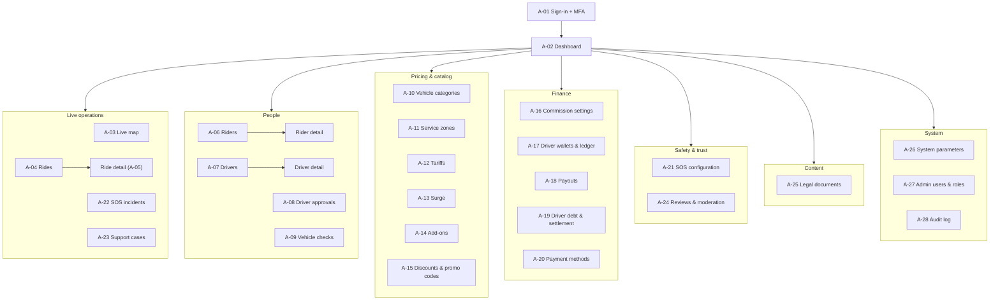
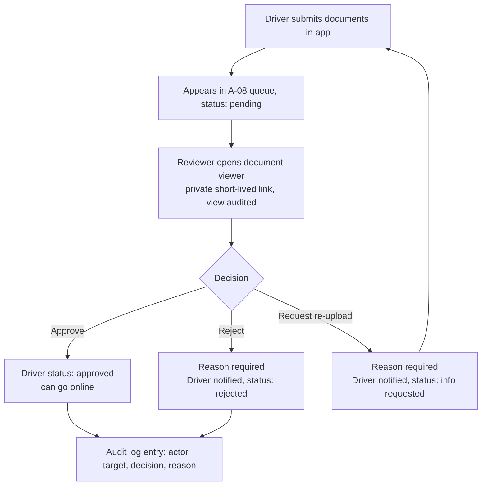
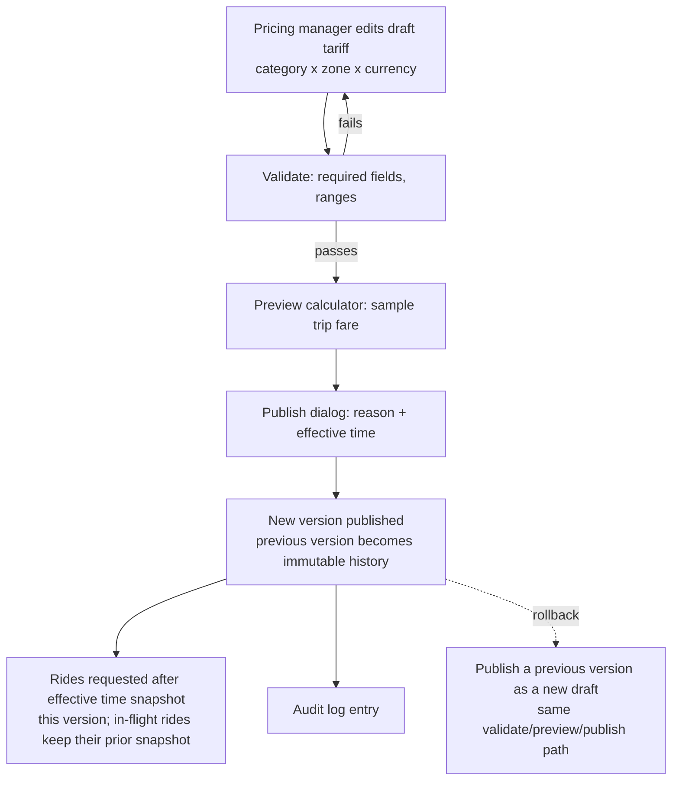
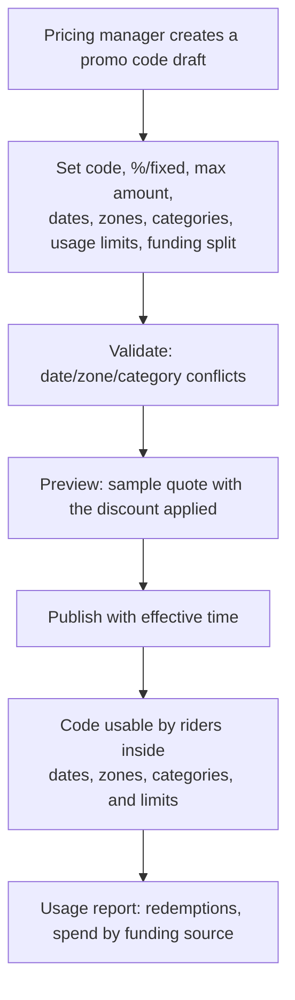
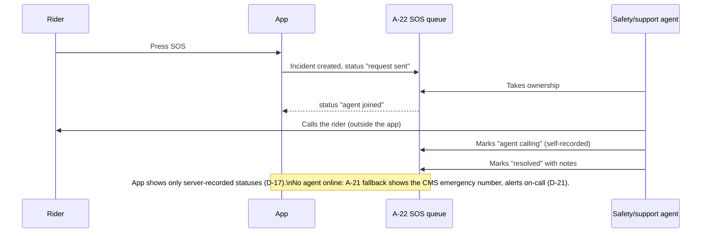
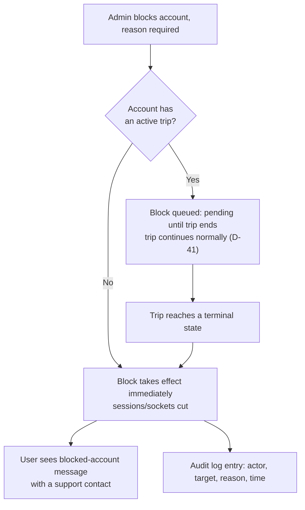

# Wasselne — Phase 1.3: Admin Console (Wasselne Admin)

**Status:** Draft for owner review (Phase 1). Design only; no application code.
**Applies to:** Wasselne Admin, the Next.js operations console.
**English-only UI (D-45).** Admin sign-in is email + password + authenticator app (TOTP); MFA is mandatory (D-18, D-09).
**Inputs:** `docs/phase-0/Wasselne_Phase0_Register.md` rev 6 (approved), `00_Design_Direction_and_Patterns.md`, `design-tokens.json`.

User-generated content (rider/driver names, chat, addresses) still displays in its original script and direction; only the console chrome is English-only.

---

## 1. Information architecture

Left nav, width `admin-nav-width` (248 px), collapses to icons below the `breakpoint-admin-desktop` (1024 px). Detail views (ride, rider, driver) open from list rows via the detail drawer or a full page — they are not separate nav items.

| Group | Nav items |
|---|---|
| — | A-02 Dashboard |
| Live operations | A-03 Live map · A-04 Rides · A-22 SOS incidents · A-23 Support cases |
| People | A-06 Riders · A-07 Drivers · A-08 Driver approvals · A-09 Vehicle checks |
| Pricing & catalog | A-10 Vehicle categories · A-11 Service zones · A-12 Tariffs · A-13 Surge · A-14 Add-ons · A-15 Discounts & promo codes |
| Finance | A-16 Commission settings · A-17 Driver wallets & ledger · A-18 Payouts · A-19 Driver debt & settlement · A-20 Payment methods |
| Safety & trust | A-21 SOS configuration · A-24 Reviews & moderation |
| Content | A-25 Legal documents |
| System | A-26 System parameters · A-27 Admin users & roles · A-28 Audit log |

A-01 (sign-in and MFA) is pre-authentication and has no nav entry. Each role sees only the groups it has at least view access to (§2); an empty group is hidden rather than shown disabled.



---

## 2. Roles and permissions matrix

Roles: **SA** Super admin · **DR** Driver reviewer · **OD** Operations/dispatch · **PM** Pricing manager · **SU** Support agent · **SF** Safety agent · **FI** Finance · **CE** Content editor · **AU** Auditor (read-only).

Legend: **F** full function access for the screen (create/edit/publish where the screen has them) · **V** view only · **S** scoped view (own assigned cases/incidents only) · **—** no nav access. Auditor is read-only everywhere by role definition, so its column is always V.

| Screen | SA | DR | OD | PM | SU | SF | FI | CE | AU |
|---|---|---|---|---|---|---|---|---|---|
| A-02 Dashboard | V | V | V | V | V | V | V | V | V |
| A-03 Live map | F | — | F | — | — | V | — | — | V |
| A-04 Rides | F | — | F | — | S | S | V | — | V |
| A-05 Ride detail | F | — | F | — | S | S | V | — | V |
| A-06 Riders | F | — | V | — | S | S | V | — | V |
| A-07 Drivers | F | F | V | — | S | S | V | — | V |
| A-08 Driver approvals | F | F | — | — | — | — | — | — | V |
| A-09 Vehicle checks | F | F | V | — | — | — | — | — | V |
| A-10 Vehicle categories | F | — | V | F | — | — | V | — | V |
| A-11 Service zones | F | — | V | F | — | — | — | — | V |
| A-12 Tariffs | F | — | V | F | — | — | V | — | V |
| A-13 Surge | F | — | V | F | — | — | — | — | V |
| A-14 Add-ons | F | — | V | F | — | — | V | — | V |
| A-15 Discounts & promo codes | F | — | V | F | — | — | V | — | V |
| A-16 Commission settings | F | — | — | V | — | — | F | — | V |
| A-17 Driver wallets & ledger | F | — | — | — | — | — | F | — | V |
| A-18 Payouts | F | — | — | — | — | — | F | — | V |
| A-19 Driver debt & settlement | F | — | — | — | — | — | F | — | V |
| A-20 Payment methods | F | — | — | — | — | — | V | — | V |
| A-21 SOS configuration | F | — | V | — | V | F | — | — | V |
| A-22 SOS incidents | F | — | V | — | S | F | — | — | V |
| A-23 Support cases | F | — | V | — | F | S | — | — | V |
| A-24 Reviews & moderation | F | — | V | — | F | V | — | — | V |
| A-25 Legal documents | F | — | — | — | — | — | — | F | V |
| A-26 System parameters | F | — | V | V | — | V | V | — | V |
| A-27 Admin users & roles | F | — | — | — | — | — | — | — | V |
| A-28 Audit log | F (view + export) | — | — | — | — | — | — | — | V (view + export) |

A-01 (sign-in, MFA enrolment/recovery) is self-service for every role and is not permission-gated.

**Separate sensitive permissions (D-33, D-34).** "View chats" and "block account" are granted independently of a screen's base access level above:

| Permission | Default roles | Rule |
|---|---|---|
| View chat (ride detail, A-05) | Super admin; Operations/dispatch (only on rides they are handling); Support agent (only their assigned case's ride); Safety agent (only an SOS-linked ride) | Reason-required prompt before the chat renders; every view is audited (D-33) |
| Block / unblock account (A-06, A-07) | Super admin; Operations/dispatch; Safety agent | Reason required, audited (D-34). If the account has an active trip, the block is queued and takes effect only when the trip ends (D-41) |

---

## 3. Cross-cutting admin patterns

**3.1 Sign-in and MFA (A-01).** Email + password, then a TOTP code from an authenticator app (D-18); MFA is mandatory for every admin, no exceptions (D-09). First sign-in forces enrolment (QR + manual key, one confirmation code) and shows 10 recovery codes once, with an "I saved these" confirmation gate. A lost device is recovered with a recovery code, or — if those are gone — a super admin resets MFA for the account (reason required, audited, forces re-enrolment at next sign-in). Failed attempts are rate-limited; error copy never distinguishes a bad email from a bad password.

**3.2 Versioned publication pattern.** Used by every CMS screen (A-10–A-15, A-21, A-25, and the tariff-like parts of A-16/A-26): **draft** (editable, not visible to apps) → **validate** (blocking schema/business-rule checks) → **preview** (calculator or rendered sample, non-binding) → **publish** (reason required, effective time — now or future-dated). A published version is immutable; the next edit opens a new draft. **Rollback** republishes a previous version's content through the same draft → validate → preview → publish path — history is never rewritten. A ride, quote, or acceptance already recorded keeps the version it snapshotted at the time; publishing a new version never alters an in-flight or completed ride (register §9, acceptance criterion 6).

**3.3 Reason-required dialogs.** Any sensitive action — approve/reject a driver, publish a CMS version, block/unblock an account, view a chat, record a wallet adjustment, resolve a case or SOS incident, reset an admin's MFA, export the audit log — opens a modal with a required free-text reason (minimum length enforced), "Confirm" disabled until filled, and a "Cancel" escape. The action and its reason are written to the audit log in the same transaction as the mutation.

**3.4 Audit logging.** Every mutation (create/update/publish/delete/approve/reject/block/adjust) and every sensitive view (chat, driver documents, case evidence) is logged: actor, role, target entity and id, action, reason (where applicable), before/after values where practical, server timestamp, and device/IP. Audit entries are immutable — never edited or deleted (A-28). Export is restricted to the roles marked in §2.

**3.5 Tables.** Every list screen provides column filters, server-side free-text search, pagination (cursor-based for large sets), sortable columns where meaningful, and CSV export only for the roles permitted on that screen (§2). Exports exclude chat content and unmask phone numbers only for roles with that field-level permission (redaction policy: `TBD-A-11`).

**3.6 Detail drawer.** A list row opens a right-side drawer (`admin-drawer-width`, 480 px) over the list so filters and scroll position persist. Deep records (ride, driver, rider) also offer "open full page."

**3.7 Real data only.** Dashboard counters and every metric are computed live from the database/cache. No placeholder or demo numbers ship in any build. A true zero ("0 active rides") renders as a real empty state, not a missing-data placeholder.

**3.8 Empty / loading / error states.** Reuses the global states from `00_Design_Direction_and_Patterns.md` §7: skeleton loading (not spinners) for lists, illustrated empty state with one action, offline banner, stale-data timestamp, plain-language server error with a reference code. Admin-specific additions: "No results for these filters" with a clear-filters action, and "You don't have permission to view this" (403, no data leaked in the response, logged as an access attempt).

---

## 4. Screen specs

### A-01 Sign-in and MFA

**Purpose:** authenticate admin staff and manage MFA enrolment/recovery.
**Roles:** all (self-service).
**Layout:** two-step form — credentials, then TOTP code; a "use a recovery code" link; enrolment flow shown once per account.
**Fields:** email, password, TOTP code, recovery code, "remember this browser for 30 days" (device-scoped only, never shared across admins).
**Actions:** sign in; enrol MFA (scan/enter key, confirm one code, show recovery codes once); regenerate recovery codes (audited); super admin resets another admin's MFA (reason required, audited, forces re-enrolment).
**States:** loading; generic invalid-credentials error; locked out with cooldown timer; "MFA not enrolled" gate that blocks every other screen until complete.
**Rules:** D-18 (admin sign-in is email + password + authenticator), D-09 (MFA mandatory). §3.1, §3.4.
**Open items:** lockout thresholds and "remember this browser" duration — `TBD-A-01`.

### A-02 Dashboard

**Purpose:** at-a-glance operational status from live data only.
**Roles:** all roles, view only, scoped to what each role can otherwise see (§2).
**Layout:**
```
+---------------------------------------------------------------+
| Wasselne Admin                    [zone: All v]  [role] [me]  |
+------------+----------------------------------------------------+
| Dashboard  |  Online drivers   Active rides   Searching         |
| Live map   |     [ 128 ]         [ 34 ]         [ 6 ]           |
| Rides      |                                                    |
| SOS        |  Open SOS         Open cases                      |
| Cases      |     [ 1 ]            [ 12 ]                        |
| People     |                                                    |
| Catalog    |  [ SOS: 1 open incident - go to queue ]            |
| Finance    |                                                    |
| Safety     |  Recent activity (audit feed, last 20)             |
| Content    |  09:41  ops.jad   published Tariff v6  Beirut/Car  |
| System     |  09:38  driver_rev.mia approved driver #4021       |
+------------+----------------------------------------------------+
```
**Fields / tiles:** online drivers, active rides, searching requests, open SOS incidents, open support cases — each a live count with a link to its screen; recent audit-feed excerpt.
**Actions:** click a tile to jump to the filtered list (e.g. open SOS → A-22 pre-filtered).
**States:** loading (skeleton tiles); error (per tile, independent retry); zero states render as real zeros, never hidden or replaced with a dash.
**Rules:** §3.7 real data only — no fake or seeded metrics in any build.
**Open items:** dashboard refresh mechanism (poll vs push over the admin websocket) — `TBD-A-02`.

### A-03 Live map

**Purpose:** operational view of drivers and active rides for dispatch/monitoring.
**Roles:** Super admin, Operations/dispatch (full); Safety agent, Auditor (view).
**Layout:**
```
+------------+----------------------------------------------------+
| Live map   | [Zone v] [Category v] [Status v]   Legend: online  |
|            | searching  stale  SOS                              |
|            +----------------------------------------------------+
| Dashboard  |                                                    |
| >Live map  |            (map canvas, driver + ride markers)     |
| Rides      |                                                    |
| SOS        |                                                    |
| ...        |                                                    |
|            +----------------------------------------------------+
|            | Selected: Driver #4021 - online - updated 4s ago   |
+------------+----------------------------------------------------+
```
**Fields:** driver markers (online, offline-but-visible-briefly, searching/on-trip, SOS), active-ride markers, zone polygon overlays, category filter, status filter.
**Actions:** select a marker to open a summary card (link to A-05/A-07); filter by zone/category/status.
**States:** loading (map skeleton); no drivers online in the selected zone (empty banner, not a blank map); a marker older than the location-freshness parameter (A-26) renders as **stale** (dimmed, timestamped) and is excluded from any live counts.
**Rules:** stale or inaccurate driver locations are never shown as live and never used for offers (register acceptance criterion 9); zone/category filters read from A-11/A-10 CMS data, never hard-coded.
**Open items:** exact stale threshold — set by the location-freshness parameter on A-26, value `TBD`.

### A-04 Rides list

**Purpose:** operational and support list of rides, live and historical.
**Roles:** Super admin, Operations/dispatch (full); Support agent, Safety agent (scoped to assigned cases/incidents); Finance, Auditor (view).
**Layout:** table (described in words — not one of the wireframed screens): filters for status, category, zone, date range, "has SOS," "has case"; search by ride id or rider/driver name (phone shown masked unless the viewer has that field permission); columns: ride id, requested time, rider, driver, category, zone, status, fare (with currency), commission flag, SOS/case flags.
**Actions:** open a row → A-05 ride detail; CSV export (Finance, Auditor, Super admin only, per §2/§3.5).
**States:** empty ("No rides match these filters"); loading skeleton; error with reference code; live auto-refresh indicator on in-progress rides.
**Rules:** D-33 (oversight scoped by permission, every access role-checked); money always shows its currency.
**Open items:** none beyond the ride-detail items below.

### A-05 Ride detail

**Purpose:** full record of a single ride: timeline, offers, fare, cash, chat, cases, reviews.
**Roles:** Super admin, Operations/dispatch (full); Support agent, Safety agent (scoped to their assigned case/incident); Finance, Auditor (view, no chat).
**Layout:**
```
+------------------------------------------------------------------+
| < Ride #R-88213                          [status: IN_PROGRESS]   |
+------------------------------------------------------------------+
| Timeline            | Fare snapshot         | Offer attempts      |
| requested 09:10:02  | Base USD 2.00         | #1 drv 4021 PENDING |
| searching 09:10:02  | +km 1.80  +min 0.90   |  ACK 09:10:05 2.1s  |
| offered  09:10:05   | surge x1.2             | declined 09:10:07   |
| accepted 09:10:07   | -promo WELCOME10       | #2 drv 4390 ACTIVE  |
| pickup   09:14:40   | = USD 5.10  commission: on               |
| in_progress 09:16:01|                        |                     |
+------------------------------------------------------------------+
| [View chat] (reason required, audited)  [Open case] [Cash record]|
+------------------------------------------------------------------+
```
**Fields:** state-transition timeline with server timestamps; offer attempts (offer id, driver, PENDING_ACK time, ACK latency, resulting ACTIVE or terminal state, decline/expiry reason); fare snapshot (currency, base/km-rate/minute-rate, surge multiplier, add-ons, discount code and amount, minimum/rounding applied, final amount, fare mode fixed/recalculate with cap, commission flag); cash record (amount, currency collected — rider's choice when both are published); linked support case (A-23) and SOS incident (A-22) if any; reviews and tip (A-24).
**Actions:** View chat (reason prompt, audited, D-33); open/link a case; flag for review; export ride record (permitted roles).
**States:** loading; error with reference code; "still searching — no offers yet"; "chat unavailable — no messages" vs. "requires the view-chat permission."
**Rules:** exactly one outstanding offer per ride (PENDING_ACK or ACTIVE), 3-second window from authenticated app ACK on the DB clock, old offer terminal before the next (register §2, no conflict found); D-15/D-20 fare snapshot and recalculation cap; D-19 dual-currency display; D-33 chat oversight and audit; D-37/D-42 tips and commission flag; acceptance criteria 6, 6a, 13a.
**Open items:** canonical wording for every terminal offer/decline reason — `TBD-A-03`.

### A-06 Riders list and detail

**Purpose:** manage rider accounts, gender declaration/confirmation, and blocking.
**Roles:** Super admin (full); Operations/dispatch (view); Support agent, Safety agent (scoped view + block); Finance, Auditor (view).
**Layout:** list (name, phone, declared gender, gender-confirmed flag, sign-up date, trip count, rating, account status) → detail drawer with trip history and actions.
**Actions:** open detail; **confirm gender after first ride** — appears once a completed ride exists, a management action rather than the rider's own edit, audited (D-39); block/unblock (reason required, audited; if a trip is active, shows "will take effect when the trip ends", D-41); view chat (separate permission, per ride, §2).
**States:** empty; loading; error; "pending gender confirmation" badge; "block pending — active trip in progress" badge.
**Rules:** D-39 (rider declares gender at sign-up, management confirms after the first ride, no penalty for a driver's mismatch report); D-34/D-41 (block/unblock, block never interrupts a ride); D-33 (chat is a separate permission from list access).
**Open items:** evidence/criteria for the management gender confirmation — `TBD-A-04` (register G-2 leaves the verification method open beyond "declared, confirmed by management").

### A-07 Drivers list and detail

**Purpose:** manage driver accounts, category qualifications, and blocking.
**Roles:** Super admin, Driver reviewer (full); Operations/dispatch (view); Support agent, Safety agent (scoped view + block); Finance, Auditor (view).
**Layout:** list (name, phone, qualified categories, vehicle, document status, vehicle-check status, wallet balance link, rating, approval status, account status) → detail drawer.
**Actions:** open detail; edit category qualifications (Driver reviewer/Super admin); block/unblock (D-34/D-41); jump to A-08 approval queue or A-09 vehicle check for this driver.
**States:** empty; loading; error; "overdue check — cannot go online" badge (D-40); "block pending — active trip" badge.
**Rules:** D-32 (verification gates going online); D-40 (overdue check blocks after grace, not immediately); D-34/D-41 (blocking); D-33 (oversight).
**Open items:** none beyond A-08/A-09.

### A-08 Driver approval queue and document viewer

**Purpose:** review submitted documents and approve/reject drivers before they can go online.
**Roles:** Super admin, Driver reviewer (full); others no access; Auditor (view).
**Layout:**
```
+------------+----------------------------------------------------+
| Approvals  | Filter: [Pending v] [Category v] [Zone v]  Search  |
|            +----------------------------------------------------+
|            | Driver          Submitted     Docs      Status     |
|            | Abed K.         2 d ago       4/4       Pending    |
|            | Rana S.         5 h ago       3/4       Pending    |
+------------+----------------------------------------------------+
| Document viewer (selected driver)                                |
| [ID front] [ID back] [License] [Vehicle reg]  expiry 2027-03-01  |
|   private short-lived link; every open is logged                 |
| [Approve] [Reject (reason)] [Request re-upload (reason)]         |
+------------+----------------------------------------------------+
```
**Fields:** driver, submission date, category applied for, document checklist with expiry dates (list per category is `TBD`, D-14), status (pending/approved/rejected/info requested).
**Actions:** Approve (unlocks "can go online," audited); Reject (reason required, driver notified); Request re-upload (reason required, status reverts to pending on resubmission); open a document (private, short-lived signed URL; every open logged as a sensitive view, §3.4).
**States:** empty ("queue is clear"); loading; error; "document expired" flag.
**Rules:** D-32 (upload to private S3 from the app, admin approval gate before going online); required-document list is CMS/legal data, not invented here.
**Open items:** required document list per category (Q14, Phase 4); approval turnaround target — `TBD-A-05`.

### A-09 Monthly vehicle check review

**Purpose:** review monthly vehicle photo submissions against the CMS interval and grace period.
**Roles:** Super admin, Driver reviewer (full); Operations/dispatch (view); Auditor (view).
**Layout:** described in words — list (driver, vehicle, last submission, interval from CMS, due date, grace deadline, status: current / due soon / overdue-in-grace / overdue-blocked) with a photo review panel.
**Fields:** as above, plus reviewer notes.
**Actions:** approve submission; reject (reason, driver must resubmit); the "blocked from going online" state is system-driven once the grace period expires — reviewers see it, they do not toggle it directly.
**States:** empty; loading; error; "reminder sent" indicator.
**Rules:** D-32 (interval and grace period set in CMS); D-40 (an overdue check never blocks at once — reminders first, then a block from going online after the grace period).
**Open items:** interval and grace-period default values — `TBD-A-06`, CMS-configurable (register G-3).

### A-10 Vehicle categories CMS

**Purpose:** create and edit vehicle categories.
**Roles:** Super admin, Pricing manager (full); Operations/dispatch, Finance, Auditor (view).
**Layout:** described in words — draft form: localized name fields (ar/en/fr), icon picker, base vehicle type (car/motorcycle/tuk-tuk), seats, driver requirements (e.g. women-only serving women riders only), required documents, zone enablement toggles, active flag; publish bar per §3.2.
**Fields:** as above, plus links to the category's tariff (A-12), commission (A-16), and discount eligibility (A-15).
**Actions:** create/edit draft; validate; preview (how it renders to rider/driver); publish (effective time, reason); deactivate (hides from new requests; existing trips unaffected).
**States:** empty ("no categories yet"); loading; error; "draft not yet published" badge.
**Rules:** D-24 (categories are CMS data; base vehicle type drives routing/vehicle rules; a driver can qualify for several categories); D-35 (women's category: women drivers, women riders only); BR-55.
**Open items:** full women's-category eligibility check logic ties to the A-06 gender-confirmation open item.

### A-11 Service zones

**Purpose:** draw, publish, and manage the polygons that define where the service operates.
**Roles:** Super admin, Pricing manager (full); Operations/dispatch (view); Auditor (view).
**Layout:**
```
+------------+----------------------------------------------------+
| Zones      | [Draft v3 v] [Preview] [Publish...] [Rollback]      |
|            +----------------------------------------------------+
|            |          (map with editable polygons)               |
|            |   +-- Beirut Central --+   status: active            |
|            |   |     (polygon)      |   categories: car, moto     |
|            |   +---------------------+                            |
+------------+----------------------------------------------------+
| Zones list: Beirut Central (active) . Jounieh (draft) . ...       |
+------------+----------------------------------------------------+
```
**Fields:** zone name, polygon geometry, status (draft/active/inactive), enabled categories per zone, version history.
**Actions:** draw/edit polygon; validate (rejects invalid self-intersecting geometry, warns on overlaps); preview (map render, affected category count); publish (effective time, reason); activate/deactivate; rollback to a previous polygon version.
**States:** empty ("no zones yet — draw the first one"); loading; error; "unpublished changes" badge.
**Rules:** D-14 (launch areas and categories are chosen by the owner in the CMS; nothing hard-coded; staff can draw, publish, and deactivate zones and enable categories per zone); place names are candidates, not boundaries (register §1 D-01).
**Open items:** geometry validation tolerances — `TBD-A-07`.

### A-12 Tariffs

**Purpose:** publish the fare components per category, zone, and currency.
**Roles:** Super admin, Pricing manager (full); Operations/dispatch, Finance, Auditor (view).
**Layout:**
```
+------------+----------------------------------------------------+
| Tariffs    | Category [Car v] Zone [Beirut v] Currency [USD v]   |
|            +----------------------------------------------------+
|            | Base       2.00      Minimum       3.00             |
|            | Per-km     0.35      Rounding       0.25             |
|            | Per-min    0.05      Fare mode   Fixed v / cap 15%   |
|            | Payment-request %  100                              |
|            +----------------------------------------------------+
|            | Preview: 6.4 km, 14 min -> USD 5.55                 |
|            | [Save draft] [Validate] [Preview] [Publish...]       |
+------------+----------------------------------------------------+
```
**Fields (per category x zone x currency):** base, per-km rate, per-minute rate, minimum fare, rounding rule, fare mode (fixed / recalculate with cap %), payment-request percentage of route (default 100%).
**Actions:** edit draft; validate (required fields, ranges — every value is admin-entered, never invented by this spec); preview calculator (sample trip in, fare breakdown out); publish (effective time, reason); rollback (publish a previous version).
**States:** empty ("no tariff published — riders can't request this category/zone/currency"); loading; error; "tariff older than N days" staleness warning.
**Rules:** D-15 (upfront pricing formula, CMS per category/zone/currency); D-19 (USD/LBP publication, either or both, rider sees both when both are published, rider may pay in either); D-20 (recalculation cap); D-28 (payment-request %, default 100%); BR-50, BR-57, BR-58; a published tariff never alters an already-agreed ride (acceptance criterion 6).
**Open items:** rounding increments and quote validity window are `TBD` pending Phase 2 confirmation; Phase 0 proposed defaults: round USD to $0.25, LBP to 5,000; quote valid 5 min (register Q12).

### A-13 Surge

**Purpose:** manual surge multiplier per zone and category, within CMS bounds.
**Roles:** Super admin, Pricing manager (full); Operations/dispatch (view); Auditor (view).
**Layout:** described in words — per zone/category: multiplier bounds (CMS min/max), on/off switch, manual override value with a schedule/expiry.
**Fields:** as above.
**Actions:** set a manual override (reason, effective window); toggle surge on/off per zone/category; publish.
**States:** empty; loading; error; "override expires in Xh" indicator.
**Rules:** D-25 (bounded by CMS min/max, on/off switch, manual override; rider sees the multiplier before requesting); D-36 (manual only at launch — automatic surge is a later version); BR-51.
**Open items:** automatic-surge formula is out of scope at launch (D-36); future work.

### A-14 Add-ons

**Purpose:** CMS-defined tolls, fees, taxes, and surcharges.
**Roles:** Super admin, Pricing manager (full); Finance, Auditor (view).
**Layout:** described in words — list + draft form: name, type (toll/fee/tax/surcharge), amount type (fixed/%), value, applicable zones/categories/times, active flag.
**Fields:** as above.
**Actions:** create/edit draft; validate; preview (effect on a sample fare); publish; deactivate.
**States:** empty; loading; error.
**Rules:** D-26 (CMS-defined add-ons; no tax or fee value is invented — the admin enters real, locally sourced values); BR-52.
**Open items:** none — every value on this screen is admin-entered, never defaulted by this spec.

### A-15 Discounts and promo codes

**Purpose:** promo codes entered by the rider and automatic category discounts.
**Roles:** Super admin, Pricing manager (full); Finance, Auditor (view).
**Layout:** described in words — type toggle (promo code / automatic category discount); draft form: code (if applicable), value (% or fixed), max discount amount, start/end dates, zones, categories, usage limits (per rider, total), funding split (platform/driver/split %); a usage report tab.
**Fields:** as above.
**Actions:** create/edit draft; validate (date/zone/category conflicts); preview (sample quote with the discount applied); publish; deactivate; view usage report (redemptions, spend by funding source).
**States:** empty; loading; error; "expired" badge; "usage limit reached" badge.
**Rules:** D-23 (two kinds, CMS-defined, shown in the quote and snapshotted with the ride); D-31 (funding split is a per-discount parameter, all money modeled through the ledger); BR-54; promo abuse mitigated by per-rider/per-phone limits and usage audit (register R-13).
**Open items:** abuse-prevention specifics beyond usage limits — `TBD-A-08` (R-13).

### A-16 Commission settings

**Purpose:** commission rate per category/zone, and the global commission-counting switch.
**Roles:** Super admin, Finance (full); Pricing manager, Operations/dispatch, Auditor (view).
**Layout:** described in words — rate table (category x zone), versioned like a tariff; a separate "commission counting" on/off switch with its own confirmation dialog.
**Fields:** commission rate (may be 0%), global commission-counting switch state and last-changed time.
**Actions:** edit rate (draft/validate/publish, versioned per §3.2); toggle the commission-counting switch (reason required; the confirmation states clearly that the change affects only rides requested after the change takes effect, shown as "in effect from <time>" — it never touches existing or in-flight rides).
**States:** loading; error; "switch changed <time> ago — N rides since" info line.
**Rules:** D-16 (commission % per category/zone, may be 0%, recorded per trip, settled on pay day); D-42 (the switch value is snapshotted onto each ride at request time as a true/false flag; only flagged rides count toward commission; tips carry no commission and are recorded for information only); BR-53, BR-66; acceptance criterion 12a.
**Open items:** pay-day cadence and report format — Phase 8 (register F-4).

### A-17 Driver wallets and ledger

**Purpose:** view each driver's ledger wallet and record adjustment entries.
**Roles:** Super admin, Finance (full); Auditor (view).
**Layout:**
```
+------------+----------------------------------------------------+
| Wallets    | Driver #4021 - Abed K.        Balance: USD 84.20    |
|            +----------------------------------------------------+
|            | Date       Type            Amount     Ref           |
|            | 09-24 09:41 trip earning    +5.10      R-88213      |
|            | 09-24 09:41 commission owed -0.51      R-88213      |
|            | 09-23 18:02 payout          -60.00     PO-0091      |
|            | 09-20 10:00 adjustment (reason: refund) +2.00       |
+------------+----------------------------------------------------+
| [Record adjustment...] (typed entry + reason, audited; no edits) |
+------------+----------------------------------------------------+
```
**Fields:** driver, current balance (derived from entries, never a stored editable field), ledger entries (date, type — trip earning / tip / commission owed / discount compensation / payout / adjustment —, amount, currency, reference, reason for adjustments).
**Actions:** record an adjustment (typed entry type + amount + required reason — never a direct balance edit); view entry detail; export ledger (Finance, Auditor).
**States:** empty ("no ledger entries yet"); loading; error.
**Rules:** D-30 (ledger wallet, immutable entries, no manual balance edits — only typed adjustment entries with reason); BR-59; acceptance criterion 13f (balances derived only from ledger entries).
**Open items:** adjustment entry type taxonomy — `TBD-A-09`.

### A-18 Payouts

**Purpose:** manage the due list and record payouts.
**Roles:** Super admin, Finance (full); Auditor (view).
**Layout:** described in words — due list (driver, balance owed, trigger reason — balance > CMS X or Y weeks since last payout —, due date, status) with a record-payout dialog.
**Fields:** as above, plus payout method (`TBD`), recorded amount/date/reference.
**Actions:** view due list (filter by zone/category); record a payout (amount, method placeholder, reference, reason if partial); export due list.
**States:** empty ("no payouts due"); loading; error.
**Rules:** D-30 (payout trigger is balance > CMS X, or Y weeks since the last payout; payout method is `TBD`); BR-59.
**Open items:** payout method — `TBD-A-10` (D-30 leaves this explicitly open); proposed interim default: manually recorded bank transfer or cash pickup until a licensed method is built (ties to A-19/A-20).

### A-19 Driver debt and settlement methods

**Purpose:** CMS-defined settlement methods for platform debt owed by a driver, and recorded collections.
**Roles:** Super admin, Finance (full); Auditor (view).
**Layout:** described in words — method list (e.g. deduct from payout, cash pickup by agent) with an enabled flag per method; collection records (date, method, amount, agent, reason).
**Fields:** as above, plus driver debt balance (from the ledger).
**Actions:** enable/disable a method (reason); record a collection (typed ledger entry, reason, audited).
**States:** empty; loading; error; "method disabled — cannot record" guard.
**Rules:** D-43 (settlement methods are CMS entities, disabled until enabled, e.g. deduct from payout or cash pickup; every collection is an admin-recorded ledger entry); BR-64.
**Open items:** full method catalog beyond the two examples — `TBD-A-11` (register G-6, Phase 8).

### A-20 Payment methods

**Purpose:** enable/disable payment methods; enforce that enabling requires both provider details and a built, tested adapter.
**Roles:** Super admin (full); Finance, Auditor (view).
**Layout:** described in words — method list (cash, OMT, Whish, bank, card, …), status (enabled/disabled), provider details section (present only once an adapter exists), adapter build/test status.
**Fields:** as above.
**Actions:** attempt to enable a method — the CMS checks that provider details AND a built/tested adapter both exist; if either is missing the toggle is **refused with an explanation** ("Adapter not built/tested — cannot enable"), never silently allowed; disable a method (reason).
**States:** "cash — enabled" (the only enabled method at launch); "disabled — no adapter"; loading; error.
**Rules:** D-38 (every method is disabled until an admin enables it and enters details in the CMS; only cash is enabled at launch; a method can be enabled only if its provider adapter is built and tested, otherwise the CMS refuses); BR-64; legal/licence review needed before any non-cash method is enabled (register R-16).
**Open items:** which non-cash adapter is built first, and its provider's legal/licence status — `TBD-A-12` (R-16, Q21).

### A-21 SOS configuration

**Purpose:** publish the SOS actions, the CMS emergency number, on-call fallback, and staffing hours.
**Roles:** Super admin, Safety agent (full); Operations/dispatch, Support agent, Auditor (view).
**Layout:** described in words — draft form: available SOS actions (priority agent chat), CMS emergency number (per zone/country), on-call alert roster, staffing hours; publish bar per §3.2.
**Fields:** as above.
**Actions:** edit draft; validate; preview (what the rider sees at each staffing state); publish (effective time, reason).
**States:** empty ("no SOS config published — flagged as a launch blocker"); loading; error.
**Rules:** D-17 (SOS opens a priority chat with a support agent, who calls the user; the app never claims a call happened); D-21 (if no agent is online, the app shows the CMS emergency number and alerts on-call staff); never invent an emergency number or staffing rule.
**Open items:** the actual emergency number(s) and staffing hours — `TBD-A-13`, owner to supply with legal input (register Q21, R-05).

### A-22 SOS incident queue

**Purpose:** priority live queue for staff handling SOS incidents, with truthful status only.
**Roles:** Super admin, Safety agent (full); Operations/dispatch (view); Support agent (scoped to assigned incidents); Auditor (view).
**Layout:**
```
+------------+----------------------------------------------------+
| SOS queue  | 1 open . sorted by wait time                        |
|            +----------------------------------------------------+
|            | Ride     Rider      Status              Waiting     |
|            | R-88250  A. Chami   request sent          0:41      |
|            | R-88190  N. Haddad  agent joined          3:12      |
|            +----------------------------------------------------+
|            | Selected: R-88250 - [Take ownership]                |
|            | Actions: mark "agent calling" . mark "resolved"     |
|            | (call happens outside the app; agent records it)    |
+------------+----------------------------------------------------+
```
**Fields:** ride/rider, status (request received / agent joined / agent calling — agent-recorded / resolved), wait time, assigned agent.
**Actions:** take ownership; mark "agent calling" (self-reported by the agent after placing the call outside the app); mark resolved (notes required).
**States:** empty ("no open SOS incidents"); loading; error; unassigned incidents highlighted at the top.
**Rules:** D-17 (truthful statuses only; the call itself happens outside the app and is recorded by the agent, never auto-claimed by the system); priority sort by wait time; acceptance criterion 11.
**Open items:** escalation timer if no agent takes ownership within N seconds — `TBD-A-14` (R-05).

### A-23 Support cases

**Purpose:** lost-item, vehicle mess/damage, and general cases, resolved with a reason and no automatic rider charge.
**Roles:** Super admin, Support agent (full); Operations/dispatch (view); Safety agent (scoped, SOS-linked cases); Auditor (view).
**Layout:** described in words — list (case type, ride reference, status) → detail: description, evidence (photos, audited viewer), messaging with parties, resolution form.
**Fields:** case type (lost item / vehicle mess-damage / general), ride reference, description, evidence, status (open / in review / resolved / closed), resolution reason.
**Actions:** assign/take case; view evidence (audited sensitive view, §3.4); message parties via the ride's chat channel; resolve (reason required; no automatic rider charge, matching journeys J4/J5 in the register).
**States:** empty; loading; error; "awaiting rider statement" status.
**Rules:** no automatic rider charge on a damage claim (register J5); evidence access is an audited sensitive view (D-33-style); traces to BR-47..49 in the original BRS (case-handling requirements referenced by the register's journeys J4/J5, not detailed in the Phase 0 register excerpt).
**Open items:** claim window and remedy rules — `TBD-A-15` (register Q16, needs process/legal input).

### A-24 Reviews and moderation

**Purpose:** view ratings and tips as recorded information, and moderate abusive reviews.
**Roles:** Super admin, Support agent (full); Operations/dispatch, Safety agent, Auditor (view).
**Layout:** described in words — list of reviews with rating, optional text, tip amount, flagged status; moderation action panel.
**Fields:** rating (format `TBD`, register Q15), optional text, tip amount (shown as recorded info only), flagged/reported reviews, moderation status.
**Actions:** hide/remove a review (reason required, audited); restore.
**States:** empty; loading; error; "only averages shown to riders/drivers" note.
**Rules:** D-37 (tips: full amount to the driver, no commission, paid in cash, recorded for information); D-42 (commission flag is unrelated to tips); review format/visibility/moderation policy is `TBD` (register Q15; proposed default: 1–5 stars plus optional text, only averages shown to users).
**Open items:** moderation policy — what content is removable — `TBD-A-16` (Q15).

### A-25 Legal documents

**Purpose:** publish versioned terms and policies per language, and track acceptance.
**Roles:** Super admin, Content editor (full); others view only.
**Layout:** described in words — document type selector (terms, privacy, cancellation policy, etc. — exact list `TBD`, never invented here), per-language (ar/en/fr) draft editor, "requires re-acceptance" flag, publish bar per §3.2, acceptance-stats tab.
**Fields:** document type, language, version, requires-re-acceptance flag, effective date, acceptance count/percentage.
**Actions:** create/edit draft per language; validate (checks which languages are required before publish — policy `TBD`); preview; publish (effective time, reason, choose whether re-acceptance is required); view acceptance report.
**States:** empty ("no version published for <language>"); loading; error; re-acceptance progress ("N of M users").
**Rules:** D-22 (admins publish terms/policies per language as versions; users accept the current version at sign-up; a new version can require re-acceptance; every acceptance recorded with version and time); BR-56; acceptance criterion 13d.
**Open items:** the legal document list and content — never invented here, `TBD`; owner supplies with local legal input (register Q21).

### A-26 System parameters

**Purpose:** CMS-tunable platform parameters, each with a validated range.
**Roles:** Super admin (full); Operations/dispatch, Pricing manager, Safety agent, Finance, Auditor (view).
**Layout:** described in words — parameter list, each with a current value, a validated range, and a publish bar per §3.2: phone visibility window (presets 30 min / 8 h / 24 h / 2 days / custom), ACK timeout, max reoffers, max search time, location freshness threshold, quote validity window.
**Fields:** as above; all numeric values are `TBD` pending owner confirmation, with a form-enforced validated range for each (e.g. ACK timeout constrained to a short-second range).
**Actions:** edit (draft/validate/publish, versioned); preview a plain-language description of the effect.
**States:** loading; error; "using Phase 0 proposed defaults" badge shown until the owner confirms a value.
**Rules:** D-44 (phone visibility window with named presets); the exclusive-offer rule itself (one outstanding offer, 3-second ACK window) is a fixed platform rule, not a CMS-editable value on this screen — only the ACK timeout, max reoffers, max search time, location freshness, and quote validity are CMS-tunable here. Register Q11/Q12 proposed (not yet confirmed) defaults: ACK timeout 5 s, 3 offers per driver per ride, 3 min max search, quote valid 5 min.
**Open items:** final values for every parameter on this screen — `TBD-A-17`, Phase 2 confirmation (register Q11, Q12).

### A-27 Admin users and roles

**Purpose:** manage admin accounts and their role assignments.
**Roles:** Super admin (full); Auditor (view).
**Layout:** described in words — list (name, email, role(s), MFA status, last sign-in, account status) → detail with role-edit and deactivate actions.
**Fields:** as above.
**Actions:** invite an admin (assign role); edit role assignment (reason, audited); deactivate an admin (reason, audited, forces sign-out); reset MFA (reason, audited, §3.1).
**States:** empty; loading; error; "invite pending" badge.
**Rules:** D-09 (MFA mandatory for every admin); role set matches the §2 matrix; every change audited (acceptance criterion 13: role-checked, MFA-protected, audited).
**Open items:** whether an admin can hold multiple roles simultaneously, and how conflicting permissions resolve — `TBD-A-18`.

### A-28 Audit log

**Purpose:** immutable record of every admin mutation and every sensitive view.
**Roles:** Super admin, Auditor (view + export); all other roles see audit entries inline on the entities they can access, not this global screen.
**Layout:** described in words — filterable table (timestamp, actor, role, action, target entity/id, reason, before/after where practical, device/IP); export button.
**Fields:** as above.
**Actions:** filter by actor/target/action/date range; search; export (Super admin, Auditor only, per §2).
**States:** empty; loading; error; "export queued" for large date ranges.
**Rules:** D-33 (oversight views audited); acceptance criterion 13 (every admin mutation role-checked, MFA-protected, audited); entries are immutable (§3.4).
**Open items:** retention period for audit records — `TBD-A-19`, needs legal input (register Q17).

---

## 5. Key admin flows

**5.1 Driver approval**


**5.2 Publishing a tariff version**


**5.3 Creating a promo code**


**5.4 Handling an SOS incident**


**5.5 Blocking an account during an active trip**


---

## 6. Open items

| ID | Item | Screen | Proposed default |
|---|---|---|---|
| `TBD-A-01` | Lockout thresholds and "remember this browser" duration | A-01 | 5 failed attempts then 15 min cooldown; browser remembered 30 days |
| `TBD-A-02` | Dashboard refresh mechanism | A-02 | Push over the existing admin websocket; poll fallback every 15 s |
| `TBD-A-03` | Canonical wording for every terminal offer/decline reason | A-05 | Built alongside the API error-code table in Phase 2 |
| `TBD-A-04` | Evidence/criteria for management gender confirmation | A-06 | Owner/process decision; no default proposed (sensitive data) |
| `TBD-A-05` | Required document list per category; approval turnaround target | A-08 | Owner supplies document list with local legal input (Q14); no SLA default proposed |
| `TBD-A-06` | Vehicle-check interval and grace-period values | A-09 | Monthly interval; 7-day grace period, reminders at day 1 and day 5 |
| `TBD-A-07` | Zone polygon validation tolerances | A-11 | Reject self-intersecting polygons; warn (don't block) on overlaps |
| `TBD-A-08` | Promo abuse prevention beyond usage limits | A-15 | Per-rider and per-device/phone limits; flag repeat redemption patterns for review |
| `TBD-A-09` | Ledger adjustment entry type taxonomy | A-17 | Refund, goodwill credit, correction, other (free text required for "other") |
| `TBD-A-10` | Payout method | A-18 | Manually recorded bank transfer or cash pickup until a licensed method is built |
| `TBD-A-11` | Debt settlement method catalog beyond the two examples | A-19 | Deduct from payout, cash pickup by agent, at launch; extend later |
| `TBD-A-12` | Non-cash adapter build order and provider licence status | A-20 | Owner/legal decision; no default proposed |
| `TBD-A-13` | CMS emergency number(s) and staffing hours | A-21 | Owner supplies with legal input; never invented |
| `TBD-A-14` | SOS escalation timer if unassigned | A-22 | Escalate to all on-call staff after 30 s unassigned |
| `TBD-A-15` | Claim window and remedy rules for support cases | A-23 | 72-hour claim window, no automatic charges at launch (register Q16) |
| `TBD-A-16` | Review moderation policy | A-24 | Remove reviews containing personal data, slurs, or off-platform contact requests |
| `TBD-A-17` | Values for ACK timeout, max reoffers, max search time, location freshness, quote validity | A-26 | ACK timeout 5 s, 3 offers per driver per ride, 3 min max search, quote valid 5 min (register Q11/Q12, unconfirmed) |
| `TBD-A-18` | Multi-role admin accounts and conflict resolution | A-27 | Disallow multiple roles at launch; one role per admin account |
| `TBD-A-19` | Audit log retention period | A-28 | Needs legal input (register Q17); no default proposed |
| `TBD-A-20` | CSV export redaction policy (phone numbers, chat content) | §3.5, all list screens | Exports always exclude chat content; phone numbers masked unless the exporting role has that field-level permission |
