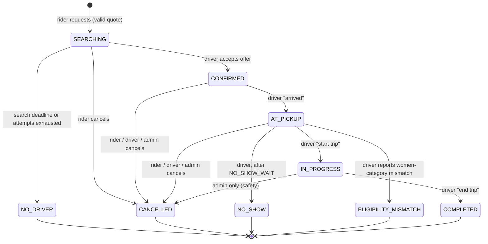
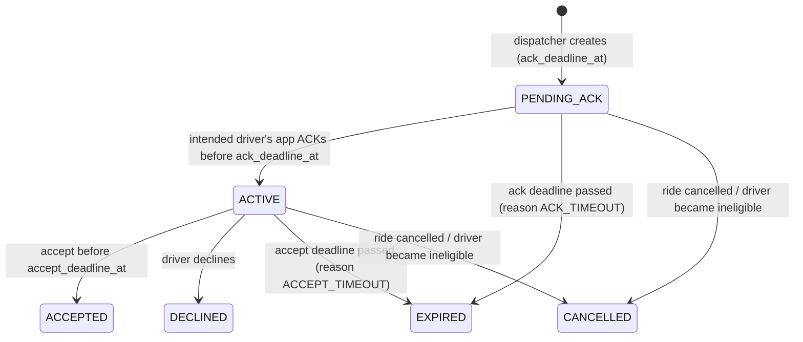
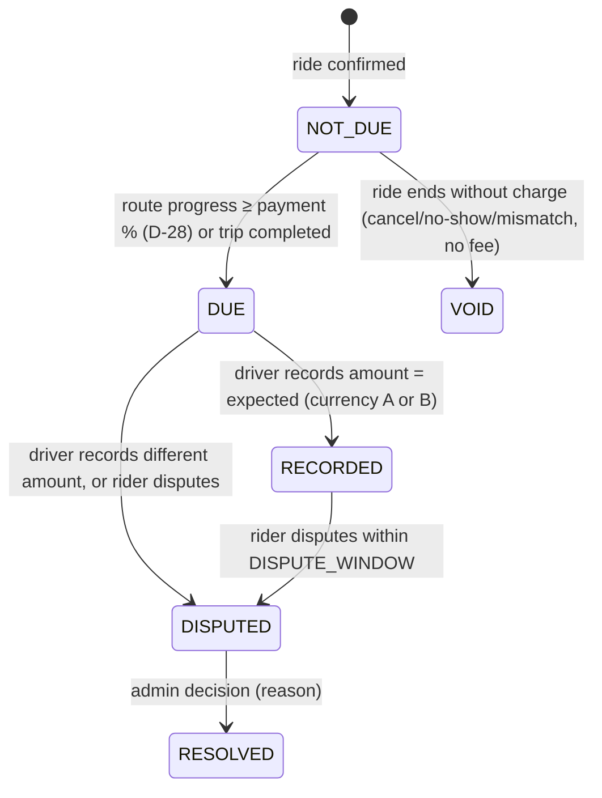

# Wasselne — Phase 2.2: State Machines and Transactions

**Status:** Draft for owner review (Phase 2). Contract for implementation; not code.
**Companions:** `01_Architecture.md`, `schema.sql`, `openapi.yaml`, `ws-events.md`.
Parameter names in `CAPS` are CMS platform settings (`platform_settings_versions`). Defaults are listed in `01_Architecture.md` §8.

---

## 1. General rules (all state machines)

1. **Single writer per aggregate.** Every state change runs in one PostgreSQL transaction that locks the aggregate row (`SELECT … FOR UPDATE`), checks the expected current state, writes the new state, appends an event row, and inserts an `outbox_events` row. Commit, then notify.
2. **Lock order** (prevents deadlocks): `rides` → `driver_profiles` (ascending id if several) → `ride_offers` → `ride_payments` → wallet rows. Never lock in another order. Never lock an offer first.
3. **Time.** Deadline checks use `clock_timestamp()` read *after* locks are held, never `now()` (transaction start) and never the phone clock.
4. **No remote calls inside a transaction.** Map, SMS, push, translation, and storage calls happen before or after, never while holding locks.
5. **Idempotency.** Every client mutation that could duplicate carries an `Idempotency-Key`. Stored in `idempotency_keys` (actor, operation, key, request hash, response). Same key + same body → the stored response. Same key + different body → `409 IDEMPOTENCY_KEY_REUSED`.
6. **Optimistic version.** `rides.version` increments on every change; events carry it, and clients drop events older than what they hold.
7. **Terminal is final.** No transition leaves a terminal state. A new attempt is a new row.

---

## 2. Ride



`CONFIRMED` is shown to users as "driver on the way". Active states: `SEARCHING, CONFIRMED, AT_PICKUP, IN_PROGRESS`. A rider has at most one active ride and a driver at most one open assignment (DB constraints).

| Transition | Actor | Guards (checked under lock) | Side effects |
|---|---|---|---|
| create → SEARCHING | Rider | Idempotency; quote belongs to rider, not expired, not used; pickup inside published zone; category enabled in zone; rider not blocked; no other active ride; terms accepted; women-only category ⇒ rider declared Female | Snapshot category, fares (all published currencies), settings version, `commission_counted` = current switch (D-42), commission rate, fare mode, cap, payment %; `search_deadline_at = clock + MAX_RIDER_SEARCH_DURATION`; reserve discount redemption; outbox `ride.searching` |
| SEARCHING → CONFIRMED | Accept transaction §3.4 | — | — |
| SEARCHING → NO_DRIVER | Worker | No outstanding offer; deadline passed or no candidate can receive a new attempt | Release discount reservation; outbox |
| → CANCELLED (rider) | Rider | State in SEARCHING/CONFIRMED/AT_PICKUP | Cancel outstanding offer (§3.6); end assignment; release discount; fee per CANCELLATION policy (none at launch) |
| → CANCELLED (driver) | Assigned driver | CONFIRMED/AT_PICKUP; reason required | End assignment; rider notified. **Policy at launch:** ride does not re-enter search; rider may request again (`TBD-2-01`) |
| CONFIRMED → AT_PICKUP | Assigned driver | Driver location within `ARRIVAL_RADIUS_M` or explicit confirm flag | `arrived_at`, no-show clock starts |
| AT_PICKUP → IN_PROGRESS | Assigned driver | — | `started_at`; begin trip trail sampling |
| AT_PICKUP → NO_SHOW | Assigned driver | `clock ≥ arrived_at + NO_SHOW_WAIT` | End assignment |
| AT_PICKUP → ELIGIBILITY_MISMATCH | Assigned driver | Category is women-only | End assignment; open `ELIGIBILITY_MISMATCH` support case; no driver penalty (D-39) |
| IN_PROGRESS → COMPLETED | Assigned driver | — | Compute final fare if fare mode = RECALCULATE (§5); payment → DUE if not already; end assignment when payment recorded (§4) |
| any active → CANCELLED (admin) | Admin with permission | Reason | Audit |

**On any terminal state:** close the driver assignment. Apply any pending account block for the rider and the driver (D-41). Stop the trip trail.

---

## 3. Offer and dispatch

### 3.1 Offer states



`PENDING_ACK` and `ACTIVE` are **outstanding**. Unique partial indexes allow one outstanding offer per ride and one per driver. `accept_deadline_at = acknowledged_at + 3 s` (fixed, D-04).

### 3.2 Dispatcher: `advance_dispatch(ride_id)`

Triggered by: outbox `ride.searching`; any offer reaching a terminal state; the sweeper (§3.7) for rides with `next_dispatch_at ≤ now`.

```
Step A — outside any transaction:
  ride = read ride (status, pickup, category, zone, deadlines)
  if ride.status != SEARCHING: return
  candidates = presence.findCandidates(pickup, category, zone)        -- Redis, §6
  candidates = maps.rankByRoadEta(candidates[:ETA_SHORTLIST])          -- optional; on provider failure keep distance order

Step B — transaction:
  lock ride FOR UPDATE; if status != SEARCHING → commit, return
  if exists outstanding offer for ride → commit, return               -- someone else advanced
  if clock ≥ search_deadline_at → ride NO_DRIVER, outbox, commit, return
  ordered = order(candidates):
       1. drivers never offered this ride (by ETA/distance)
       2. then previously offered drivers with driver_attempts < MAX_OFFERS_PER_DRIVER,
          fewest attempts first, oldest last attempt first
  for d in ordered:
      lock driver_profiles[d] FOR UPDATE
      if not eligible_now(d, ride): continue                           -- §3.3
      insert ride_offers(state=PENDING_ACK, attempt_no = ride.dispatch_attempts+1,
                         driver_attempt_no, ack_deadline_at = clock + DELIVERY_ACK_TIMEOUT)
      ride.dispatch_attempts += 1; ride.next_dispatch_at = null
      outbox offer.created (driver-targeted)
      commit; return
  -- nobody eligible right now
  if no driver in the zone can still receive an attempt and no fresh candidates exist
       and clock + DISPATCH_RETRY_INTERVAL ≥ search_deadline_at → ride NO_DRIVER
  else ride.next_dispatch_at = clock + DISPATCH_RETRY_INTERVAL
  commit
```

A unique-index violation on insert (a race with another dispatcher) rolls back. The code then re-reads and returns, because the other writer won.

### 3.3 `eligible_now(driver, ride)` (in PostgreSQL, under the driver lock)

All must hold:
- driver profile `APPROVED`, account not blocked (`account_blocks` effective), not `block_pending`
- an open `driver_online_sessions` row
- approved `driver_category_approvals` for the ride's category, not paused by the driver
- vehicle check not past `due_on + VEHICLE_CHECK_GRACE_DAYS` (D-40)
- no required document expired
- if the category is women-only: driver gender = FEMALE and confirmed by admin (D-35)
- no outstanding offer (any ride) and no open assignment
- if the debt limit is enabled: wallet balance ≥ −`DRIVER_DEBT_LIMIT` (D-43)
- Redis presence is fresh (checked in step A; re-read in step B is not required. Freshness is a shortlist quality rule, and PostgreSQL eligibility is the correctness rule)

### 3.4 ACK: `POST /v1/driver/offers/{id}/ack`

```
transaction:
  lock ride; lock driver (caller); lock offer
  offer.driver_id != caller                       → 403 OFFER_NOT_FOR_DRIVER
  offer.state == ACTIVE                           → 200 same accept_deadline_at (duplicate ACK)
  offer.state != PENDING_ACK                      → 410 OFFER_EXPIRED / OFFER_ALREADY_RESOLVED
  t = clock_timestamp()
  t ≥ offer.ack_deadline_at                       → set EXPIRED(ACK_TIMEOUT); outbox; commit; 410 OFFER_EXPIRED
  offer.state = ACTIVE; acknowledged_at = t; accept_deadline_at = t + 3 s
  outbox offer.active
  commit → 200 { offer, accept_deadline_at, server_now: t }
```

Client rule (Phase 1 DS §2.2): send ACK only once the offer is rendered on screen.

### 3.5 Accept: `POST /v1/driver/offers/{id}/accept` (Idempotency-Key)

```
transaction:
  idempotency hit → return stored response
  lock ride; lock driver; lock offer
  offer.driver_id != caller                       → 403
  offer.state == ACCEPTED (by caller)             → 200 stored confirmed snapshot
  offer.state != ACTIVE                           → 409 OFFER_NOT_ACKNOWLEDGED | 410 OFFER_EXPIRED | 409 OFFER_ALREADY_RESOLVED
  t = clock_timestamp()
  t ≥ offer.accept_deadline_at                    → offer EXPIRED(ACCEPT_TIMEOUT); outbox; commit; 410 OFFER_EXPIRED
  ride.status != SEARCHING                        → offer CANCELLED; commit; 409 RIDE_ALREADY_ASSIGNED
  not eligible_now(driver) excluding own offer    → offer CANCELLED; commit; 409 DRIVER_NOT_ELIGIBLE
  insert ride_assignments(ride, driver, vehicle)  -- partial unique indexes are the last guard
  offer.state = ACCEPTED; ride.status = CONFIRMED; confirmed_at = t; ride.version++
  create ride_payments(status NOT_DUE, expected amounts per currency)
  discount redemption reserved → stays reserved until completion
  outbox ride.changed (rider + driver), offer.terminal
  store idempotency response; commit → 200 ride snapshot
```

### 3.6 Decline and cancel

- **Decline:** lock ride, driver, offer. If the state is `ACTIVE` and the caller is the driver, set `DECLINED` and enqueue `advance_dispatch`. A terminal offer returns `200` with its current state and changes nothing. A decline can never affect a later offer ID.
- **Ride cancelled while an offer is outstanding:** set that offer `CANCELLED` in the same transaction as the ride change. The driver gets `offer.terminal`.
- **Driver becomes ineligible** (block, suspension, offline, category paused): the transaction that changes the driver also cancels the driver's outstanding offer, locking the ride first. The code reads the offer's `ride_id` without a lock, then locks ride → driver → offer, then rechecks.

### 3.7 Sweeper (worker, every `SWEEP_INTERVAL_MS`, default 500 ms)

```
due_offers = SELECT id, ride_id FROM ride_offers
             WHERE (state='PENDING_ACK' AND ack_deadline_at < clock_timestamp())
                OR (state='ACTIVE' AND accept_deadline_at < clock_timestamp())
             ORDER BY least(ack_deadline_at, accept_deadline_at) LIMIT 100      -- no lock
for each: transaction { lock ride → driver → offer; recheck state + deadline;
                        set EXPIRED with reason; outbox offer.terminal }  then advance_dispatch(ride)
due_rides  = SELECT id FROM rides WHERE status='SEARCHING'
             AND (next_dispatch_at < clock OR search_deadline_at < clock) LIMIT 100
for each: advance_dispatch(ride)
```

Several workers may run. Row locks plus rechecks make duplicates harmless: one wins, and the others see the new state and stop. A crashed worker leaves only durable rows, which the next sweep picks up. There are no in-memory timers to lose.

### 3.8 Invariants and how each is proven in tests (Phase 6)

| Invariant | Enforced by | Test |
|---|---|---|
| ≤ 1 outstanding offer per ride | partial unique index + ride lock | 50 parallel dispatch triggers on one ride |
| ≤ 1 outstanding offer per driver | partial unique index + driver lock | two rides dispatching to one driver simultaneously |
| ≤ 1 open assignment per ride / per driver | partial unique indexes | parallel accepts by two drivers (after forced dual offers are impossible, simulate by direct accept on stale IDs) |
| No acceptance after deadline | `clock_timestamp()` under lock | accept at deadline ± 5 ms with lock contention |
| Old offer terminal before next exists | same transaction ordering + index | kill worker between expiry and next offer |
| Duplicate ACK never extends window | ACTIVE branch returns stored deadline | repeat ACK after 2 s |

---

## 4. Payment (per ride)



- **Payment percentage.** `payment_request_pct` is snapshotted on the ride; the launch default is 100%. When it is 100%, the payment becomes DUE at `COMPLETED`. Below 100%, the server computes progress as the distance travelled along the planned route, from trip samples, divided by the planned distance. When progress crosses the threshold it sets DUE and emits `payment.due`.
- **Recording.** `POST /v1/driver/rides/{id}/payment` records currency, amount, and optional tip, with an Idempotency-Key. The currency must be one of the ride's published fare currencies.
- **Completion order.** The driver may press End trip before or after recording payment. The assignment closes when the ride is COMPLETED *and* the payment is RECORDED or DISPUTED. The driver can't receive offers until then, which keeps the cash step from being skipped by accident. `TBD-2-02`: an admin override exists for stuck cases.
- **On RECORDED or DISPUTED**, the ledger postings for the ride are written in the same transaction (§5.3).
- **Future non-cash methods (D-29):** DUE → CHARGE_PENDING → RECORDED, or CHARGE_FAILED → DUE with the method switched to cash. These states are reserved in the enum and unused at launch.

---

## 5. Fare calculation and ledger

### 5.1 Quote (per category, per published currency)

For each currency in `PUBLISHED_CURRENCIES` with a published tariff for the category and zone:

```
distance_km, duration_min = route provider (traffic-aware) for pickup→dropoff
raw        = base + per_km × distance_km + per_minute × duration_min
surged     = raw × surge_multiplier                      (manual surge, bounded by SURGE_MIN/MAX; D-25, D-36)
addons     = Σ fixed add-ons in this currency + Σ percent add-ons × surged
gross      = max(minimum_fare, surged + addons)
discount   = min(max_discount, percent × gross  |  fixed amount in this currency)
total      = round_half_up(gross − discount, rounding_increment); total ≥ 0
```

- **Arithmetic:** integers in minor units with basis points (`multiplier_bp`, `percent_bp`). Round only once, at the end. Intermediate values use numeric with no floats.
- **Discounts** apply only if a discount is valid for the rider, zone, category, time, and limits. At most one promo code plus automatic discounts; they don't stack by default (`TBD-2-03`: best one wins).
- **Missing currency.** If a currency has no tariff, it is left out. If no currency has one, the category is "unavailable" for this zone.
- **Stored per quote:** amounts and a breakdown per currency, tariff version IDs, surge, add-ons and discount snapshot, distance, duration, `expires_at = now + QUOTE_TTL`.

### 5.2 Final fare (RECALCULATE mode only)

At completion, the same formula uses the ride's **snapshotted** tariff, surge, add-ons, and discount, with actual distance and duration from the trip trail. The result is clamped to `quoted_total × (1 + cap)`. A lower final fare is allowed (`TBD-2-04`). In FIXED mode, final = quoted.

### 5.3 Ledger postings at payment RECORDED/DISPUTED

Driver wallet sign convention: **positive = Wasselne owes the driver**. Postings are made in the currency the rider paid.

| Entry | Amount | Condition |
|---|---|---|
| `COMMISSION` | −(commission_rate × gross) | ride `commission_counted` = true (D-42) |
| `DISCOUNT_COMPENSATION` | +(discount × platform_share) | discount applied and platform funds part of it (D-31) |

The rider's cash goes to the driver directly, so it is not a wallet entry. Tips are information only. Postings use idempotency key `ride:{id}:{entry_type}` (unique), so a replay writes nothing. Corrections are new `ADJUSTMENT` or `REVERSAL` entries with a reason. Ledger rows cannot be updated or deleted; a DB trigger enforces it.

### 5.4 Payout and settlement

- **Payout due** (per driver, per currency) when balance ≥ `PAYOUT_THRESHOLD[currency]`, or `PAYOUT_MAX_WEEKS` have passed since the last payout and the balance is > 0 (D-30). A worker marks drivers due; an admin records the payout, which adds a `PAYOUT` entry of −amount. The payout method is `TBD`.
- **Driver debt** (balance < 0) is settled through CMS-enabled settlement methods (D-43), recorded by an admin as a `SETTLEMENT` entry of +amount.

---

## 6. Presence (Redis) contract

| Key | Type | Content | TTL |
|---|---|---|---|
| `geo:drivers` | GEO set | member = driver_id | none (swept) |
| `presence:{driver_id}` | hash | lat, lng, accuracy_m, captured_at, seq, zone_id, categories (csv), session_id, busy | 2 × PRESENCE_FRESHNESS |

- **Location update** (`POST /v1/driver/locations` or socket `driver.location`): reject if the sequence is not higher than the stored one, or if `captured_at` is older than PRESENCE_FRESHNESS or more than 30 s in the future. Reject if accuracy > LOCATION_ACCURACY_LIMIT_M (the app is told "weak GPS"). Otherwise `GEOADD` and `HSET`.
- **findCandidates:** `GEOSEARCH geo:drivers FROMLONLAT … BYRADIUS SEARCH_RADIUS_M ASC COUNT 50`. Keep members whose hash exists, is fresh, is not busy, and includes the category. Return at most `ETA_SHORTLIST`.
- **Sweeper:** every 30 s, `ZREM` members with no presence hash.
- **Redis unavailable:** dispatch returns no candidates, and rides go to NO_DRIVER at their deadline. The rider sees "No drivers available". Assignments never come from Redis alone.

---

## 7. Support case, SOS incident, driver onboarding

**Support case:** `OPEN → IN_REVIEW → (WAITING_USER ↔ IN_REVIEW) → RESOLVED → CLOSED`. RESOLVED requires a resolution text. A case never creates a charge by itself (BR-48).

**SOS incident:** `RECEIVED → AGENT_JOINED → AGENT_CALLING → RESOLVED`. `AGENT_CALLING` is recorded by the agent. At creation, if no agent is on shift (`support_agent_presence` empty or outside SOS hours), the server sets `no_agent_fallback = true`, returns the CMS fallback number, and enqueues the on-call alert. The alert delivery status is stored as `oncall_alert_status`: QUEUED, SENT, or FAILED. If nobody takes ownership within `SOS_UNASSIGNED_ESCALATION_S`, the on-call alert fires again.

**Driver profile:** `ONBOARDING → SUBMITTED → (NEEDS_CHANGES → SUBMITTED)* → APPROVED | REJECTED`. `APPROVED ↔ SUSPENDED` (admin). Category approvals are separate rows. A document's lifecycle is `UPLOADED → APPROVED | NEEDS_CHANGES | REJECTED`, then `→ EXPIRED`, or `→ SUPERSEDED` when replaced.

**Vehicle check:** `DUE → SUBMITTED → APPROVED | NEEDS_CHANGES`. Past `due_on` counts as overdue, and past `due_on + grace` the driver is ineligible (D-40). A new check row is created at `approved_at + VEHICLE_CHECK_INTERVAL_DAYS`.

**Account block:** creating a block with `effective_at = now`, when the user has no active ride, revokes sessions and disconnects sockets. If a ride is active, `effective_at` stays null (pending) and the ride-terminal hook applies it (D-41).

---

## 8. Reconnect and snapshots

- `GET /v1/me/active-ride` (rider) and `GET /v1/driver/state` (driver: online session, current offer, active ride, payment) are the recovery endpoints. Clients call them on app start, resume, socket reconnect, and on any event-version gap.
- Every socket event carries `aggregate_version` and `server_now`. Clients ignore events older than their state and resync on a gap.
- The offer countdown is always rebuilt from `accept_deadline_at − server_now`, never from a stored local timer.

## 9. Open items from this document

| ID | Item | Proposed default |
|---|---|---|
| TBD-2-01 | Driver cancels after confirmation: search again automatically? | No; rider re-requests |
| TBD-2-02 | Admin override to close a stuck payment | Yes, audited |
| TBD-2-03 | Discount stacking | Best single discount wins |
| TBD-2-04 | Recalculated final fare lower than quote | Allowed |
